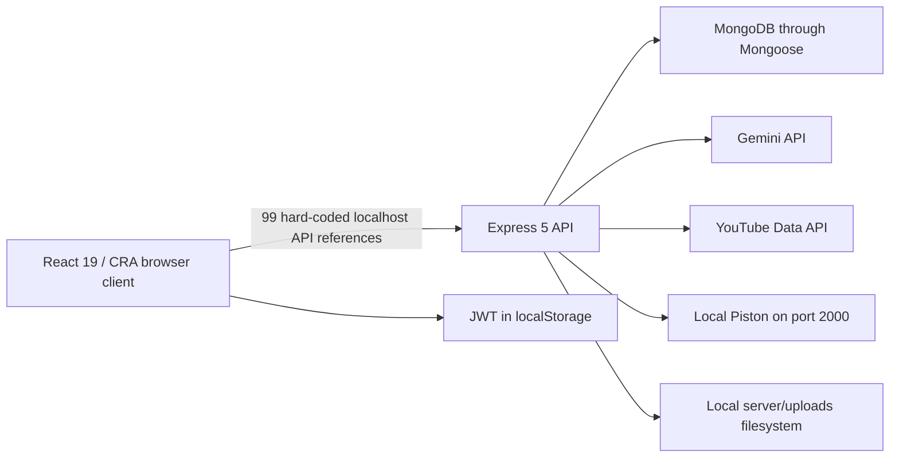
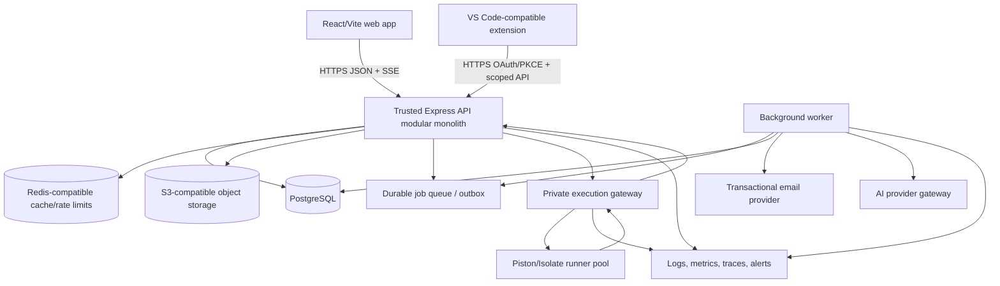
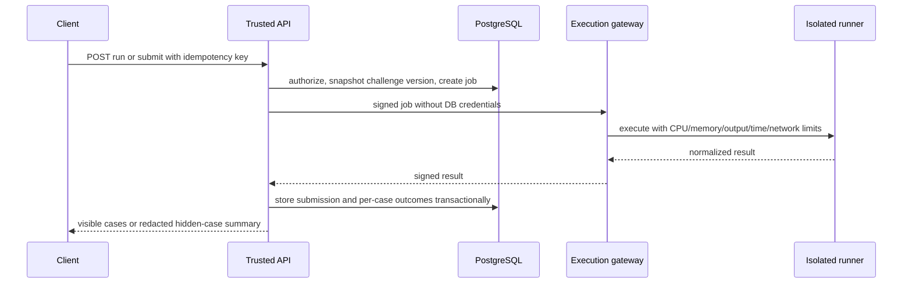
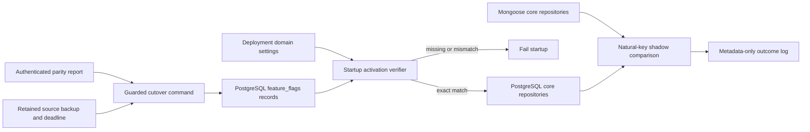

# CodeWithMee Architecture

**Status:** Target architecture decision record  
**Audit date:** 2026-07-31  
**Scope:** The current repository and the complete Phase 0-6 platform

## 1. Executive architecture decision

CodeWithMee should evolve as a **modular monolith with a separate untrusted-code execution plane**, not as a collection of microservices. The web application and trusted API should remain simple to run and deploy, while the only inherently hostile workload—user code—must be isolated behind a queue and a private runner service.

The target baseline is:

- React + Vite + TypeScript for the web client.
- Node.js + Express + TypeScript for the trusted API and background worker.
- PostgreSQL as the authoritative relational database, accessed through Prisma and versioned migrations.
- S3-compatible object storage for images, videos, assignment ZIPs, resources, and workspace archives.
- Redis-compatible storage only for rate limits, short-lived cache, and queue coordination; PostgreSQL remains authoritative.
- Piston/Isolate (or an equivalent container/microVM runner) on dedicated Linux capacity for code execution.
- Transactional email for verification, invitations, payment review, grading, and moderation notifications.
- OpenTelemetry-compatible structured logs, metrics, traces, and error reporting.

This is a deliberate migration away from MongoDB. The current `User` document embeds roadmaps, two chat histories, notes and media metadata, video progress, solved challenges, memberships, follows, requests, blocks, and preferences. Posts embed recursively nested comments and reactions. Those shapes will grow without a safe bound, make cross-entity invariants difficult, and prevent reliable grading, credit ledgers, invitations, and payment review. The repository is still prototype-stage, so a controlled Phase 0 migration is lower risk than carrying those constraints through six phases.

## 2. Current architecture



Current characteristics:

- One browser bundle contains public, learner, company/provider, moderator, and superadmin screens.
- Route files contain validation, authorization, persistence, response mapping, and business rules together.
- Authentication has separate `User` and `Company` credentials and places `accountType` in the JWT.
- The API starts listening even when the database connection fails.
- All uploads are served publicly from local disk.
- Code-run and challenge-submit endpoints call an HTTP Piston service directly and synchronously.
- AI calls are synchronous and store conversations inside the user document.
- There is no worker, queue, migration framework, API versioning, centralized error model, test suite, or deployment definition.

## 3. Target logical architecture



### Trust boundaries

1. The browser and extension are untrusted clients. UI route guards are convenience only.
2. The trusted API performs authentication, authorization, validation, state transitions, and response redaction.
3. Object storage is private by default. The API issues short-lived, purpose-bound upload/download URLs.
4. AI and video providers are external systems; inputs and outputs are treated as untrusted.
5. The runner plane is hostile by definition. It has no database credentials, object-storage credentials, application secrets, or unrestricted egress.
6. Workers consume signed jobs and use idempotency keys. User-facing requests do not wait for email, video processing, AI blueprint generation, or long-running grading.

## 4. Repository target structure

The migration should preserve the existing repository rather than create an unrelated replacement. The end state should be a workspace with shared contracts:

```text
CodeWithMe/
  apps/
    web/                    # React/Vite application
      src/
        app/                # routing, providers, error boundaries
        features/           # auth, challenges, learning, courses, space, ideas, ide
        components/         # reusable accessible UI
        lib/                # API client, telemetry, validation helpers
    api/                    # Express trusted API
      src/
        modules/            # domain modules listed below
        middleware/
        infrastructure/
        jobs/
        app.ts
        server.ts
    worker/                 # email, media, AI, analytics, outbox consumers
    extension/              # VS Code-compatible extension
    execution-gateway/      # private adapter to runner pool
  packages/
    contracts/              # OpenAPI-generated types and runtime schemas
    config/                 # lint, TypeScript, test shared configuration
    ui/                     # optional shared web UI primitives
  prisma/
    schema.prisma
    migrations/
    seed/
  infra/
    docker/
    render.yaml             # free-demo option
    cloudflare/
    monitoring/
  scripts/
    migrate-mongo-to-postgres/
    seed/
  docs/
```

During Phase 0, `client/` and `server/` remain active until parity checks pass. They are moved or replaced incrementally, with a documented rollback point for each cutover.

## 5. Trusted API module boundaries

| Module          | Owns                                                           | Must not own                                 |
| --------------- | -------------------------------------------------------------- | -------------------------------------------- |
| `identity`      | users, auth identities, sessions, verification, password reset | organization permissions or social graph     |
| `organizations` | providers, memberships, roles, invitations                     | course content                               |
| `challenges`    | challenge versions, cases, starter files, submissions          | runner implementation                        |
| `execution`     | execution jobs, limits, runner adapter, result redaction       | direct web UI state                          |
| `learning`      | lesson/video/module/course progress and resume state           | provider authoring                           |
| `courses`       | course drafts, modules, lessons, resources, publishing         | enrollment/payment state                     |
| `assessments`   | quizzes, attempts, written answers, assignments, grades        | file bytes                                   |
| `enrollments`   | invitations, enrollments, payment proofs/reviews               | course editing                               |
| `social`        | profiles, follows, posts, comments, reactions, feed            | moderation decisions                         |
| `moderation`    | reports, cases, actions, appeals, audit trail                  | content authoring                            |
| `credits`       | immutable credit ledger, awards, balances                      | arbitrary point increments in feature routes |
| `ideas`         | ideas, collaborators, artifacts, suggestions, votes, updates   | repository credentials                       |
| `workspaces`    | templates, workspace files/snapshots, validation results       | host filesystem access                       |
| `integrations`  | AI, email, YouTube, object storage adapters                    | domain authorization                         |
| `notifications` | in-app delivery, preferences, read state                       | originating business transaction             |
| `operations`    | health, readiness, audit events, idempotency, outbox           | domain-specific policy                       |

Phase 0B now implements `server/modules/authority` as the compatibility slice between identity, organizations and operations. It owns no credentials or feature content: it coordinates transaction-only platform role/status/session/audit changes, organization ownership swaps, the one-shot bootstrap command, and field-minimized audit reads. Its repository boundary maps directly to the Phase 0C PostgreSQL operations/identity/organization transaction without changing the API service contract.

P0C-S1 establishes that PostgreSQL target as an executable, checksum-pinned Prisma 7 baseline. It intentionally does not switch runtime repositories: the current modular services remain on their compatibility adapters while P0C-S2 inventories source data and P0C-S4 performs normalized imports. Database mutations are scope-guarded, and migration CI applies from empty, seeds twice and tests relational invariants on PostgreSQL 16. The generated client is build output; controllers still cannot expose ORM rows directly.

Each module follows `route -> request schema -> controller -> service/policy -> repository -> response schema`. Controllers do not expose ORM rows directly.

## 6. Key runtime flows

### 6.1 Web authentication

1. Local login verifies an Argon2id password; Google login verifies an authorization-code flow server-side.
2. The API issues a 10-15 minute access token and a rotating refresh token stored in a `Secure`, `HttpOnly`, `SameSite=Lax` cookie.
3. Refresh-token families are stored hashed, rotated on every use, and revoked on reuse or logout.
4. The access token contains only immutable identifiers and a session ID. Current roles and organization membership are loaded or cached server-side.
5. State-changing cookie-authenticated endpoints enforce origin and CSRF controls.

### 6.2 Extension authentication

1. The extension creates a PKCE verifier/challenge and opens the CodeWithMee web authorization page.
2. The user authenticates in the browser and approves scopes.
3. A one-time authorization code returns through the VS Code URI handler.
4. The extension exchanges the code and verifier for short-lived access and rotating refresh tokens stored in VS Code SecretStorage.
5. Tokens are limited to extension scopes such as `ideas:read`, `blueprints:create`, `workspaces:write`; no password or browser local-storage token is copied.

### 6.3 Challenge execution



`Run Code` executes only visible examples or custom input. `Submit Code` executes the immutable challenge version's hidden tests. Hidden inputs, expected outputs, reference solutions, and checker code never enter learner responses, logs, analytics payloads, or client bundles.

### 6.4 Learning progress

- Progress is keyed by `(user_id, enrollment_id, lesson_id)` rather than by a raw video ID.
- Video position updates are monotonic within a short tolerance, throttled, and versioned.
- A lesson-completion policy considers content type: explicit acknowledgement for notes, watched threshold for video, passing attempt for quiz/challenge, and accepted grade for required assignment.
- Module and course progress are derived from lesson progress and cached; clients cannot directly set percentages.
- Every update records `updated_at` and a server revision. The server is authoritative; clients use revision-aware last-write handling for playback position.

### 6.5 Course publishing

- Providers edit a draft revision.
- Publish performs validation, freezes a version, and emits an outbox event.
- Enrollments reference a published course version so later edits do not silently change assessment requirements.
- A provider can publish a new version and explicitly migrate or grandfather enrollments.

### 6.6 Media and file submission

1. The client requests an upload intent with filename, MIME, size, and purpose.
2. The API checks authorization and quota, creates a pending file record, and returns a short-lived presigned upload.
3. The client uploads directly to private object storage.
4. A worker verifies actual type/signature, scans the object, extracts safe metadata, and marks it ready or quarantined.
5. Domain records reference only ready files. Downloads are authorized and use short-lived signed URLs with safe content disposition.

ZIP assignments are never extracted by the trusted API. If validation requires extraction, a sandboxed worker rejects path traversal, symlinks, device files, excessive file counts, decompression bombs, and oversized expanded content.

### 6.7 Feed and notifications

- Feed queries are cursor-paginated and apply block/privacy rules in the database query, not after fetching an unbounded collection.
- Comments use a separate table with `parent_id` and bounded nesting, not recursive embedded arrays.
- Domain transactions append outbox events. A worker creates notification rows and sends optional email without risking the originating transaction.
- Notification delivery can begin with polling/SSE; WebSockets are optional only when bidirectional real-time features exist.

### 6.8 AI blueprint generation

- Blueprint requests are asynchronous jobs with quotas, moderation, explicit user confirmation, model/prompt version, and provenance.
- User-supplied text and retrieved artifacts are delimited as data, not interpolated into privileged system instructions.
- Output is validated against a strict schema and stored as a draft; it never executes automatically or writes to a repository without a reviewed plan.
- The UI labels generated content and provides regenerate, edit, delete, and report controls.

## 7. Frontend architecture

- Feature folders own pages, queries, forms, and tests.
- A single configured API client uses `VITE_API_BASE_URL`; no route contains a literal host.
- TanStack Query (or an equivalent server-state layer) manages caching, cancellation, retries, and invalidation. Local component state is reserved for transient UI.
- React Router loaders/guards may improve UX, but authorization remains server-side.
- Forms share runtime schemas with API contracts where practical.
- Rich text is stored as a restricted document format or sanitized HTML. AI markdown uses a vetted parser plus sanitizer; raw `dangerouslySetInnerHTML` is forbidden without a reviewed sanitizer boundary.
- Responsive layouts support 360 px upward. The IDE uses a tabbed/mobile mode rather than displaying a warning as the primary solution.
- WCAG 2.2 AA basics are release gates: keyboard navigation, visible focus, semantics, contrast, reduced motion, captions/transcripts, and screen-reader labels.

## 8. Consistency and event model

- PostgreSQL transactions protect enrollment, grading, follow/block, credit, payment-review, and publishing invariants.
- Unique constraints make retries safe: one enrollment per course/user, one reaction per actor/target/type, one vote per voter/suggestion, one follow edge per pair, and one accepted invitation redemption.
- Every externally triggered mutation supports an idempotency key where duplicate effects are costly.
- The transactional outbox is the bridge to workers. Domain state and an outbox row commit together; workers are at-least-once and handlers are idempotent.
- Credits use an immutable double-entry-style ledger or, at minimum, immutable signed deltas with a unique source reference. Cached balances are reconciled from the ledger.
- Destructive administration is soft-delete or state transition by default, with retention and audit events. Hard deletion is an explicit privacy/retention workflow.

## 9. Non-functional targets

Initial production targets after Phase 6:

- Availability: 99.5% application/API target; code runner may have a separately published target.
- API latency excluding execution/AI: p95 under 500 ms for normal reads and under 800 ms for normal writes.
- Feed: cursor pagination with no full-collection in-memory sort or privacy filtering.
- Recovery: paid production RPO <= 24 hours and RTO <= 4 hours initially; tighten with adoption.
- Uploads: explicit per-purpose size caps; no general 100 MB unaudited upload endpoint.
- Execution: hard wall-clock, CPU, memory, process, file, and output limits; outbound network disabled.
- Observability: every request/job has a correlation ID; security-sensitive actions have immutable audit records.
- Browser support: current Chrome, Edge, Firefox, and Safari; responsive validation at 360, 390, 768, 1024, and 1440 px.

## 10. Architecture migration and rollback

1. Freeze and export the current MongoDB schema/data and `server/uploads` manifest; do not assume current local uploads are disposable.
2. Add PostgreSQL, Prisma migrations, and new services alongside existing Mongoose reads.
3. Write a repeatable, checksum-producing migration script for users, identities, roadmaps, progress, challenges, social data, provider data, and files.
4. Copy files to object storage and rewrite URLs only after hash verification.
5. Run read-only parity reports for counts, owners, relationships, and progress.
6. Cut over by domain behind feature flags, beginning with identity and challenges.
7. Keep the MongoDB snapshot read-only through an agreed rollback window.
8. Remove Mongoose and local upload serving only after acceptance criteria and backup restore drills pass.

P0C-S2 implements steps 1 and 3 as a fail-closed operator boundary without claiming a live export. The source adapter is reachable only with migration-specific read-only configuration; the application connection string is not a fallback. A schema-versioned registry covers all 18 legacy collections, canonical BSON-compatible records receive stable checksums/target UUIDs, and each encrypted record is authenticated before parsing. Operator reports expose HMAC fingerprints and safe structural metadata only. The planner never opens PostgreSQL, quarantines ambiguous relationships/credentials and marks every legacy challenge test visible. P0C-S3 owns private object transfer; P0C-S4 owns reviewed target writes; P0C-S5 owns source parity and feature-flag cutover.

## 11. Rejected architecture alternatives

| Alternative                                                                        | Decision          | Reason                                                                                                                                             |
| ---------------------------------------------------------------------------------- | ----------------- | -------------------------------------------------------------------------------------------------------------------------------------------------- |
| Keep all state embedded in MongoDB                                                 | Reject for target | Document growth and cross-domain invariants are already unsafe; LMS grading, payments, social graph, and credit ledgers are relational.            |
| Immediate microservices                                                            | Reject            | Operational complexity exceeds current team/product maturity; module boundaries plus a separate runner provide the needed isolation.               |
| Run code inside the Express process with `vm2`, `python-shell`, or child processes | Reject            | Language sandboxes are not a host-security boundary; `vm2` has critical advisories and the API host contains secrets.                              |
| Call a public Piston service for production                                        | Reject            | The public API is not a dependable commercial capacity plan; runner control, quotas, and data handling require owned infrastructure or a contract. |
| Store media on the backend filesystem                                              | Reject            | Free hosts use ephemeral filesystems and horizontal scaling would create inconsistent media.                                                       |
| Separate company login as the provider model                                       | Reject            | A person may be learner, instructor, grader, and organization admin; organization membership must be independent from identity.                    |
| Let clients set progress percentages or award points                               | Reject            | Both are derived/ledger state and are currently forgeable or farmable.                                                                             |
| Browser-generated authoritative certificates                                       | Reject            | Anyone can forge them; certificates require server-issued records and verification IDs.                                                            |
| Full cloud IDE/container per learner in Phase 1                                    | Defer to Phase 5  | Challenges need a narrow execution contract first; persistent workspaces multiply security and cost.                                               |

## 12. Architecture completion criteria

The architecture is considered implemented only when:

- all production data is in migrated, constrained PostgreSQL tables;
- all user files are private object-storage objects with authorized access;
- clients use versioned APIs and generated/shared contracts;
- unified identity and organization membership replace account-type branching;
- the trusted API has no facility for executing arbitrary user code locally;
- background jobs are idempotent and backed by an outbox/queue;
- the extension uses scoped PKCE authentication and SecretStorage;
- deployment, recovery, security, and observability gates in `docs/DEPLOYMENT_PLAN.md` and `docs/SECURITY_PLAN.md` pass.

## 13. P0C-S3 file-module implementation

`server/modules/files` is the first production-shaped PostgreSQL runtime module. Its HTTP router depends on a file service; the service depends only on repository, object-store, organization-authorizer, clock and identifier contracts. Production composition supplies the PostgreSQL repository and AWS SDK v3 S3-compatible adapter. Tests supply deterministic memory adapters, so provider absence never changes domain semantics.

The lifecycle is `upload_pending → uploaded → ready` or `quarantined`, followed by logical `deleted`. The API creates metadata before a client receives a PUT, confirms the object through HEAD, emits `file.scan.requested` transactionally, accepts an idempotent trusted scan result, and issues GETs only after a current policy decision. Visibility cannot bypass readiness. Deletion emits object cleanup work; the separately approved retention command handles stale pending/quarantined records.

The current server stays CommonJS while Prisma 7 generates TypeScript ESM through the `prisma-client` generator. To avoid an unverified runtime transpilation or duplicate data model, the file repository uses parameterized `pg` transactions against Prisma-managed tables. This is an adapter detail, not an architectural split: Prisma owns migrations, constraints and generated schema contracts; services own transaction-safe workflows and DTOs. P0C-S4 may consolidate the runtime module system but must keep the repository interface and all behavioral tests.

Legacy profile/note/social disk handlers now check the development-only compatibility gate before Multer allocates a file and no longer create upload directories at module import. Production refuses `LOCAL_UPLOAD_SERVING=true`; otherwise `/uploads` returns a retirement response. Existing bytes remain untouched until owner-reviewed migration.

## 14. P0C-S4 offline import architecture

The normalized migration path is an operator process, not an API module:

1. a dedicated read-only source identity creates the authenticated P0C-S2 snapshot;
2. the dry-run planner validates cross-collection semantics and produces redacted quarantine decisions;
3. a separately guarded PostgreSQL process authenticates that snapshot, verifies exact target/dataset approval, and writes deterministic targets plus provenance;
4. P0C-S5 compares source, import and runtime projections before switching any domain flag.

The importer separates record writers from orchestration. Writers know only the normalized PostgreSQL transaction and deterministic target mapping; orchestration owns authenticated-source limits, plan decisions, import-run idempotency, transaction isolation, quarantine continuation and redacted summary. This avoids a dual-database runtime dependency and prevents a live source changing during target writes.

## 15. P0C-S5 persistence authority and cutover topology

P0C-S5 completes parameterized PostgreSQL repositories for the existing identity, organization and authority service contracts. The repositories preserve rotating refresh families, replay compromise, single-use tokens, owner/invitation/review transactions, serialized superadmin/role/status updates, session revocation, exact ownership and append-only audit metadata. The CommonJS service boundary remains unchanged; Prisma continues to own schema/migrations while repositories own transaction-safe DTO mapping.

Runtime selection is deliberately not a generic database switch. Each domain has one store, and configuration rejects PostgreSQL for direct-Mongoose feature routes until their owning phase introduces a repository boundary. Identity, organizations and authority share IDs and policy state, so they move as one atomic unit. During that limited core cutover, the unversioned legacy API is disabled and returns a deterministic 410; this prevents PostgreSQL UUID principals from reaching Mongo ObjectId handlers. This dependency requires the core cutover unit to precede feature-domain cutovers, while P0D and Phases 1–4 must complete each feature adapter before its flag becomes eligible.



The report is a canonical aggregate signed with an independent HMAC key. It includes per-domain source/outcome counts, warning codes, target existence, structural checks and table counts but no source IDs, paths, emails or exception values. A domain with a quarantine, error exception, missing target or failed invariant is not ready. Shadow reads never participate in a response and compare only natural-key methods after stripping IDs, timestamps and secrets.

Activation writes database-side records only during a confirmed freeze; deployment settings must then match store, environment, database, generation, dataset, parity checksum, rollback snapshot and deadline. Rollback reverses database authority under another freeze, redeploys the complete core unit to Mongoose and invalidates sessions from the cutover window. [ADR 0002](adr/0002-persistence-cutover-authority.md) and [the runbook](runbooks/PERSISTENCE_CUTOVER.md) are normative.

The additive schema is deliberately a normalized home for existing data, not premature completion of future phases. Challenge versions/tests, course versions/modules/content, social parent/interaction rows and idea updates provide stable extension points for Phases 1–4. P0C-S5 now provides the core runtime adapters and one-store controls, but every flag remains on Mongoose without live parity. P0D and the owning phases must modularize each direct feature route before its normalized rows become public runtime authority.

## 16. P0C-S6 recovery and legacy-retirement boundary

Recovery is layered rather than coupled to one provider. Managed PITR and encrypted native PostgreSQL custom-format exports are the production authority; versioned/replicated private objects protect file bytes. The repository-owned portable archive is a bounded cross-provider verifier: a repeatable-read snapshot converts all application values to lossless PostgreSQL text, binds them to the ordered migrations/schema hash, compresses and encrypts with AES-256-GCM, then restores only into a distinct migrated target. Restore resolves reviewed nullable cycles, rejects other existing data and verifies a complete re-export digest before its serializable transaction commits.

Object reconciliation is a separate read-only boundary over `files`, the configured object-store prefix and HMAC-fingerprinted legacy-upload inventory. Reports contain only keyed references and cannot mutate storage. The legacy-removal evaluator consumes recovery/parity/reconciliation/retention state but is permanently non-destructive; [ADR 0003](adr/0003-layered-backup-and-legacy-retirement.md) requires a later exact-target change record even when every gate is ready.

## 17. Executable API contract boundary

P0D-S1 introduces a contract layer above domain routers and below Express handlers. `server/modules/api/operations.js` is the route inventory; `contracts.js` owns JSON Schema 2020-12 request and response definitions; `middleware.js` applies those same request definitions at runtime; and `openapi.js` publishes OpenAPI 3.1.1. This avoids a second handwritten documentation model.

The validator is constrained and non-coercing. It supports only the reviewed keywords used by the contract, resolves local component references, rejects unknown properties recursively, emits no rejected values and stops after a bounded issue count. Business rules remain in services. New schema keywords require validator and negative-test changes in the same commit. Ajv is present only as a Prisma development transitive dependency and is not treated as a production runtime contract after approval to add it directly was denied.

The route contract layer does not own persistence or authorization. It establishes shape, stable operation identity and public DTO allowlists; identity guards and policy services still make current-state access decisions. P0D-S2 centralizes errors/logging around this boundary, and P0D-S6 supplies durable idempotency/outbox behavior behind the already-defined header convention.

## 18. Central HTTP lifecycle and observability seam

P0D-S2 establishes one outer Express lifecycle: request context, CORS/parser/router execution, not-found mapping and final error mapping. Domain routers no longer terminate errors locally, so Express 5 async rejection and explicit `next(error)` share the same behavior. The seam is injection-friendly: tests supply log destinations and readiness checks without a live database.

The structured logger serializes one JSON record per event, bounds collections and strings, survives cycles and redacts keys for credentials, tokens, cookies, email, IP and user-agent data. Startup, database state, identity/files, shadow reads, operator bootstrap, providers and retained legacy routes now emit stable event/error codes; direct server `console.*` calls were removed. Phase 6 owns transport, retention, alerting and trace export.

Health checks are separate from business routes. Liveness never probes a dependency. Public readiness executes required checks in parallel under a timeout and reveals only aggregate state. The superadmin-only dependency route reuses current-principal policy evaluation and returns a fixed name/status vocabulary. This supports container/load-balancer probes now without committing to a monitoring vendor.

## 19. HTTP security boundary

P0D-S3 inserts one browser/abuse boundary after request context and before body parsing or application routers. Security headers and exact CORS are response policy; Fetch Metadata plus trusted-origin evaluation are request policy; the operation registry supplies body and rate classes. This keeps domain routers unaware of deployment topology while preventing an unknown route from inheriting an unbounded parser.

Express proxy trust is disabled unless `TRUSTED_PROXY_CIDRS` contains reviewed exact IP/CIDR entries. The rate limiter hashes the resulting client address with an ephemeral secret and stores only the digest/window/count. Its store is injectable: one bounded memory store supports development and genuinely single-instance free hosting, while a shared atomic adapter and edge controls are a Phase 6 deployment concern. Route classification and problem semantics do not change when that adapter changes.

## 20. Restricted-content boundary

P0D-S4 separates stored source from rendering. The server owns a small exact document envelope and normalization/bounds contract. The client owns an AST-like React renderer that constructs only text, paragraph, list, emphasis and code nodes; it never converts source into an HTML string. URL policy is independent and deny-by-default. A recursive source test prevents reintroduction of raw HTML execution APIs.

Legacy note HTML is a migration state, not a supported rendering format. Mongo subdocuments without a marker and pre-existing PostgreSQL rows are `legacy_html_v0`; reads derive plaintext without writing back. New Mongo notes and future PostgreSQL writes are `plain_text_v1`. This ordering preserves source/rollback evidence while closing execution immediately. Richer authoring later extends the versioned node allowlist and migration, not the HTML sink.

## 21. Executable authorization and projection coverage

The v1 operation registry now has an exact, separately reviewed security manifest. Route inventory, authorization mode, resource boundary, exposure and permission must evolve together; a missing or extra operation fails the repository test. This layer describes the security shape but does not replace current-state policy evaluation in identity, organization, authority and file services.

Response safety is structural. Contract schemas and DTO functions select approved fields, while tests inject synthetic secret-bearing persistence records to prove those fields cannot cross the boundary. Authority audit projections follow the same rule and accept only revision, role, owner and status metadata. P0D-S6 builds audit, idempotency and outbox reliability behind these operation identities without widening the public contract.

## 22. Audited operations and background-work seam

P0D-S6 adds a provider-neutral operations layer beside the domain modules. Audit, idempotency and outbox each expose a bounded memory adapter for tests/local development and a parameterized PostgreSQL adapter over the Prisma-owned tables. The composed runtime selects PostgreSQL whenever a pool exists, reports memory use explicitly outside production, and disables the operations authority in production when PostgreSQL is absent. No feature can interpret memory success as a durability claim.

Idempotency acquisition is actor/operation/key scoped and lease-owned; audit is append-only and state-allowlisted; outbox delivery is at least once through event locks plus per-attempt `job_runs`. These primitives are independent of web transport so Phase 1–5 services can compose them inside their transaction boundaries and Phase 6 can run workers separately. The worker handler must therefore remain idempotent even though claims prevent concurrent active leases.

The legacy route list is no longer an anonymous array: each mount has a state, replacement and final roadmap owner. Bearer-only authentication is common to every protected retained handler. Feature routes are removed after their versioned owner passes rather than before; the all-at-once persistence switch remains available for a coordinated store cutover.

## 23. Client application shell and state primitives

P0E-S1 establishes one application shell around the active route tree. The shell owns the skip link, main landmark, theme variables, header, ambient background, scroll indicator, authenticated notes widget and optional cursor effect. A top-level error boundary covers the shell as well as route content, emits only the stable `codewithmee:ui-error` browser event, and provides a semantic recovery state without exposing exception text.

Design values live under the `--cwm-*` namespace. Stored or server-returned theme colors are normalized to exact six-digit hexadecimal values before becoming CSS custom properties; unknown presets and invalid persistence fall back to the reviewed default. Global focus, target size and reduced-motion rules form the baseline for route-specific P0E-S2/S3 work rather than claiming that every legacy control is already accessible.

`AsyncState` is the common loading, empty and error contract. It supplies status/alert semantics, live-region behavior, a bounded responsive surface and explicit retry/action slots. Authentication restoration, route misses and primary data loading for the dashboard, challenge catalog/solver, course catalog, Space and admin entry now use this contract. Domain mutation errors remain owned by their later route slices.

## 24. Responsive route compatibility layer

P0E-S2 keeps each inspected page stylesheet as the desktop visual authority and loads one final compatibility layer after route modules. The layer establishes shrink-safe route roots and explicit phone/tablet/wide viewport classes at 390, 768, 1024 and 1440 CSS pixels; 360 px uses the narrower phone class. It stacks dashboard/course/workspace/provider structures, constrains modals and forms, and preserves horizontal overflow only for tables, code/output and explicit scroll-track controls.

This is deliberately not a replacement design system or route rewrite. Provider compatibility CSS is safe at mobile widths while its route remains redirected until Phase 2 authorization/content work. The admin and challenge tables retain wide semantic rows inside named scroll containers instead of deleting data for mobile. Existing route guards and domain behavior are unchanged.

Mobile Notes now uses the authenticated existing workflow in a viewport-bounded panel. Its floating control is a real button with expansion state; the list can be toggled to maximize editor room. Drawing remains disabled on mobile because the current canvas interaction is not touch-safe, but plaintext note use is no longer blocked by a misleading desktop-only popup. P0E-S3 owns deeper keyboard semantics, and P0E-S6 owns automated multi-viewport visual evidence.

## 25. Client interaction and accessible-media boundary

P0E-S3 gives reusable interactive primitives one semantic owner. `AppDropdown` is a portal-positioned single-select menu whose trigger and options remain native buttons; it owns selected-radio semantics, Arrow Up/Down, Home/End, Escape/Tab behavior and focus return. Route section selectors remain ordinary labeled button groups with pressed state because the application does not yet implement the complete ARIA tab focus/arrow contract.

`AccessibleDialog` owns dialog naming, modal state, initial focus, Tab containment, Escape/backdrop close and focus restoration. Learning, social, enrollment, provider and timer overlays consume the same primitive. This is a client behavior boundary only: closing an overlay never substitutes for a server-side authorization decision or mutates protected data by itself.

`AccessibleMedia` is the sole direct video/audio renderer. It accepts real caption and transcript sources when available and otherwise emits an explicit legacy-unavailable notice. The application never synthesizes or implies captions that have not been reviewed. External video frames are named and carry the same availability disclosure, while future provider media records can supply rights-cleared tracks without changing route structure.

Global focus-visible, reduced-motion and higher-contrast rules apply after legacy route styling; route outline suppression has been removed. Animated backgrounds stop initializing for reduced-motion users, and decorative cursor media is assistively hidden. The rich Notes editor is a named multiline textbox; its drawing canvas explicitly remains pointer-required, with plaintext notes as the safe keyboard fallback. Static contracts protect these invariants now; P0E-S6/P0F owns real-browser axe, screen-reader and keyboard-flow evidence.

## 26. Shipped-surface and compatibility-retirement boundary

P0E-S4 makes `client/src/main.tsx` the root of a closed shipped-source graph. Every JavaScript, TypeScript, stylesheet and imported asset in `client/src` must be reachable from that entrypoint, excluding declaration files. A source contract resolves static relative imports and rejects orphan files. This prevents abandoned components and duplicate styles from silently remaining part of the product tree.

The client route set is exact. The old `/company/dashboard` path remains only as a redirect tombstone; it cannot load the removed `accountType`-coupled provider dashboard or call the already-retired company-course handlers. Phase 2 introduces a new organization-scoped provider surface rather than reviving that source. The unreachable private-course employee-ID modal is likewise removed so invitation and enrollment authority can be implemented once through the Phase 2 model.

Removal is presentation-only unless an owning migration says otherwise. Legacy Job Simulation, provider, course, note and upload records are untouched. Compatibility HTTP code remains behind `LEGACY_ROUTE_LIFECYCLE`: two families are tombstones and eight have exact replacements/final owners. All v1 operations and every legacy verb handler are frozen in the product-surface inventory, so later retirement changes both the replacement and inventory evidence rather than deleting an unknown route.

Visible previews must be truthful and noninteractive. Broken `/notes` and `/simulations` links, fake Notes sharing/direct messaging, inert settings sections and placeholder artwork were removed. Monaco is the sole challenge editor and PrismJS is no longer shipped. If a future preview is materially useful before its owning phase, it needs an explicit capability contract; hard-coded “Coming Soon” actions are not a feature flag.

## 27. Media eligibility and legacy-upload quarantine boundary

P0E-S5 separates technical media validity from deployment eligibility. A byte can enter a client or server artifact only when an owned manifest records its source, intended-use right or grant, consent where applicable, accessibility alternative, digest, and review state. A Git author, descriptive filename, valid signature or playable codec is never a substitute. The unproven promo is preserved byte-for-byte under repository quarantine, outside all application roots, and its home-page import is removed. Undocumented remote interaction sounds are removed completely from runtime construction, so a page visit no longer preloads third-party audio or discloses visitor network metadata to that host.

`server/uploads` is a frozen private migration input, not a source directory or deployment artifact. New files under it are Git-ignored; production local serving remains fail-closed with `410`. Existing bytes are neither renamed nor promoted from filename inference. The Phase 0C migration pipeline must copy a byte to an opaque private object key only after authoritative source-record mapping, purpose/visibility classification, signature/checksum validation and exception quarantine, then prove parity and rollback before any retention decision.

Working-tree deletion and Git-history remediation are distinct destructive operations. Neither is part of P0E-S5. The former requires parity, backup, retention expiry and exact approved inventory IDs; the latter additionally requires owner approval, collaborator coordination, host-cache handling and a force-push recovery plan. Free-tier operation therefore keeps ambiguous media private or unavailable and uses silent/owned presentation assets until validation capacity exists.

## 28. Route-delivery and browser-regression boundary

P0E-S6 makes the React route tree an explicit code-delivery boundary. All 13 page modules are dynamic imports behind one semantic `Suspense` state, while shell, identity restoration and error recovery remain in the initial graph. Vite emits a manifest, and `check-client-performance.mjs` recursively measures the entry, home and Auth dependency graphs rather than trusting filenames or one aggregate bundle number. Every client build fails when gzip route transfer, initial request count, largest raw artifact or total raw build exceeds the checked-in budget.

JavaScript splitting must not change CSS precedence. `route-styles.css` is the eager owner for route/component styles; `responsive.css` is imported immediately afterward as the final compatibility override. Lazy modules do not import those styles again. This deliberately accepts a bounded 26.94 kB gzip initial stylesheet to prevent route navigation from reordering or duplicating presentation rules.

`p0e-s6.scenarios.json` is the cross-phase browser contract. It freezes 15 route patterns, five viewport fixtures, role/data fixtures, preference states and keyboard/focus flows. Phase 0F may implement the driver and deterministic fakes without redesigning coverage. Public production-preview observations are recorded separately from declared cases: anonymous home layout passed all five widths and Auth passed at phone width, while authenticated/provider/admin, keyboard injection, axe and screen-reader evidence remain unclaimed until their isolated fixtures exist.

## 29. Test isolation and external-service seams

P0F-S1 keeps three explicit test layers. Client component behavior runs in Vitest/jsdom through the same Oxc JSX pre-transform as Vite production builds. Server API, service and repository tests continue to use `node:test`; repository-level source/configuration contracts also remain `node:test`. The root `test` command runs all three layers in that order and fails if any layer has no passing implementation.

Client tests start at the non-routable `codewithmee.test` origin, install deterministic media-query behavior, clean the DOM between cases and replace global `fetch` with a throwing stub. A test must opt into an in-process response; accidental provider, localhost or production calls are defects. Browser automation is deliberately separate because jsdom does not prove layout, navigation, CSP or browser accessibility behavior.

Server test support exposes fixed clocks/sequences and isolated AI, video, email, object-storage and runner adapters. Scripted adapters capture cloned structured requests and throw when no outcome is declared. Storage additionally models private upload intent, byte length, SHA-256 metadata and object existence. None imports a provider SDK or process/network executor. Later phases should inject these stable interfaces rather than mock module internals; production composition remains responsible for real adapter selection and configuration validation.

## 30. Disposable PostgreSQL test lifecycle

The database integration entrypoint owns its complete data lifecycle. It accepts an administrative URL only when the safety scope is `disposable`, the host is loopback, the database is the PostgreSQL `postgres` maintenance database, an explicit user exists and the test prefix is bounded and non-production. It generates source/restore identifiers from the approved prefix plus 12 hex characters; every interpolated identifier passes a strict lowercase identifier allowlist before quoting.

The source target receives all six immutable migrations and two idempotent authorization seeds before the real integration suite runs. That suite checks named database constraints, normalized fixture import, PostgreSQL identity/organization/authority adapters, file reconciliation, signed parity, cutover activation and rollback. Portable backup creates a separate restore target and proves authenticated restore plus non-empty replay rejection.

Both exact targets are force-dropped in the outer `finally`, even if migration, seed, constraints or restore fail. A parameterized `pg_database` query then requires zero matches before the command can report success. The GitHub workflow uses this same entrypoint against PostgreSQL 16.14 and does not provide a static application database URL. This is a CI/testing privilege boundary only; staging and production application roles must never have database-creation authority.

## 31. Protected-browser fixture boundary

P0F-S3 drives the production Vite artifact through Playwright Chromium. Browser identity is established only by the same refresh/login HTTP paths used by the client; fixture data is `.invalid`, scoped to one page/context and never persisted as a production credential. A separate context proves learner denial at the superadmin route. Every unconfigured API receives an explicit synthetic failure, and every unmanaged HTTP origin, page exception, global overflow or landmark failure blocks the run.

The five flows cover local sign-in, mobile navigation, profile update, challenge statement/example read and provider-review role scope. Each stable page state runs WCAG 2.0/2.1 A/AA axe rules with serious/critical blocking. Screenshots and traces are failure-only; service workers, video and retries are disabled so neither caching nor reruns conceal state leakage/flakiness.

The current Monaco React wrapper remains a compatibility boundary rather than the Phase 5 IDE. Its URL is pinned to exact `monaco-editor@0.56.0`; E2E intercepts that exact path and serves bytes from the installed package, proving no test network dependency. Production self-hosted editor workers/assets, multi-file workspaces and offline behavior remain Phase 5 work and must replace the CDN path before a hardened public release.

## 32. CI gate and supply-chain boundary

P0F-S4 separates four trust and cost domains: ordinary quality/policy checks, protected browser tests, CodeQL SAST and disposable PostgreSQL recovery. The quality job uses the three committed lockfiles and named commands; browser state cannot leak into it, CodeQL receives only the permissions needed to publish security events, and the database creator credential exists only inside its isolated service job. Neither browser nor database fixtures use production credentials.

Repository-native policy modules are pure evaluators with CLI wrappers and hostile regression fixtures. OpenAPI comparison is read-only and byte-exact. Audit and license exceptions bind workspace/package/advisory/version/license, carry a reason and expire; a changed or fixed dependency makes the exception fail instead of silently widening it. Secret scanning rejects known provider token shapes everywhere and sensitive hardcoding outside deterministic fixture paths. Workflow and container checks bind actions to commits and images to digests and reject high-risk execution configuration.

There is no deployable application container yet. Therefore the container gate proves one immutable PostgreSQL service reference and reports zero Dockerfiles; it does not pretend an image vulnerability scan occurred. Phase 6A creates runtime images, at which point the existing policy immediately requires digest-pinned bases/non-root execution and Phase 6B adds CVE, SBOM, provenance and signature verification.

## 33. Observability and Phase 0 release boundary

HTTP requests now carry W3C-style trace/span context beside the existing request ID. Completion, normalized failures and outbox batches feed a bounded low-cardinality in-process telemetry interface; an injected error reporter receives metadata only and cannot break responses. The provider-neutral interface is the stable seam for Phase 6 OTLP/error exporters. Process-local counters are a development fallback, not durable monitoring.

The synthetic contract checks only public liveness/readiness through HTTPS or loopback and never embeds credentials. `phase0:gate` reads the authoritative tracker/evidence and blocks Phase 1 while any prerequisite through P0F-S5 is unverified. Passing it authorizes local Phase 1 implementation only; production remains governed by the explicit NO-GO list in `PHASE_0_RELEASE_GATE.md`.
