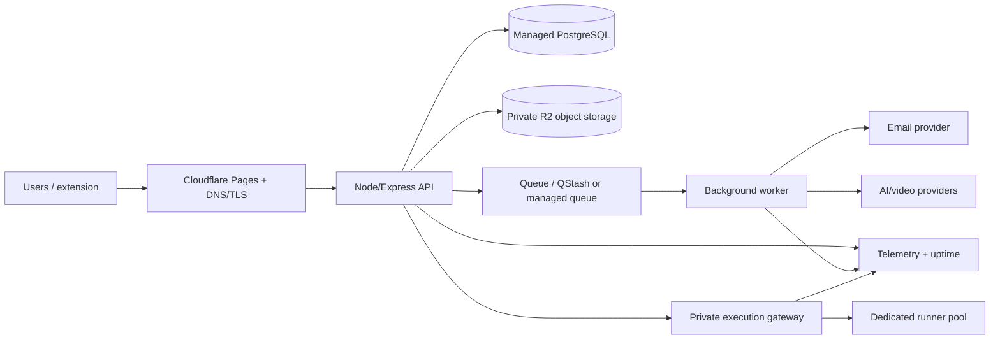

# CodeWithMee Deployment Plan

**Status:** Free-demo and production upgrade architecture  
**Audit date:** 2026-07-31  
**Important:** Free-tier terms and quotas change; verify linked official pages immediately before deployment.

## 1. Deployment principles

- Maintain separate `development`, `staging`, and `production` environments with separate databases, buckets, OAuth clients, email domains/keys, queues, and runner credentials.
- Build once and promote an immutable artifact by digest. Do not rebuild different code for production.
- The trusted API is a modular monolith; worker and execution gateway use the same contracts but deploy as separate processes.
- Never store durable uploads on the application filesystem.
- Never run untrusted code in the API/worker container or on a general free web service.
- Free infrastructure is a **demo/beta path**, not a production reliability claim. Production social media, provider payments, private files, and code execution need paid capacity and backups.

## 2. Deployment topology

## 3. Free demo plan

| Concern             | Recommended free/demo service                        | Verified allowance/limitation (2026-07-31)                                                                                                                                                                                                                                               | Product implication                                                                                                                                                      |
| ------------------- | ---------------------------------------------------- | ---------------------------------------------------------------------------------------------------------------------------------------------------------------------------------------------------------------------------------------------------------------------------------------- | ------------------------------------------------------------------------------------------------------------------------------------------------------------------------ |
| Frontend            | Cloudflare Pages                                     | Free Pages allows 500 builds/month, 20,000 files, and 25 MiB per asset ([official limits](https://developers.cloudflare.com/pages/platform/limits/))                                                                                                                                     | Suitable for the React SPA. P0E-S5 quarantined the unproven 17.7 MB promo outside the build; user media must enter private R2 only through the reviewed object pipeline. |
| API                 | Render Free web service                              | Spins down after 15 minutes idle, can take about a minute to wake, uses an ephemeral filesystem, has 750 workspace hours/month, and Render says free instances are not for production ([official free-service docs](https://render.com/docs/free))                                       | Suitable only for preview/demo. Cold starts break a polished learning experience; uploads must never use local disk.                                                     |
| Database            | Neon Free PostgreSQL                                 | $0 with 0.5 GB storage per project, 100 CU-hours/month/project and 6-hour time travel/restores ([official pricing](https://neon.com/pricing))                                                                                                                                            | Enough for development and a small invite-only demo, not media or long-lived production backups. Use connection pooling and quotas.                                      |
| Object storage      | Cloudflare R2 Standard                               | 10 GB-month, 1M Class A and 10M Class B operations/month are free; direct R2 egress is free ([official pricing](https://developers.cloudflare.com/r2/pricing/))                                                                                                                          | Viable for small image/document beta. Video reads can exhaust operation/storage economics despite free egress.                                                           |
| Email               | Resend Free                                          | 3,000 transactional emails/month and 100/day ([official pricing](https://resend.com/pricing))                                                                                                                                                                                            | Enough for verification and small invitations; queue and suppress retries/bounces.                                                                                       |
| Background delivery | Upstash QStash Free                                  | 1,000 messages/day, 1 MB message, 10 schedules, 3-day DLQ/log retention ([official pricing](https://upstash.com/pricing/qstash))                                                                                                                                                         | Good for beta email/AI/media callbacks. Jobs store IDs, not file/content payloads.                                                                                       |
| Observability       | Better Stack Free or equivalent OpenTelemetry target | Free personal tier lists 10 monitors/heartbeats, 3 GB logs and traces retained 3 days, 30 GB metrics, and 100,000 exceptions/month ([official pricing](https://betterstack.com/pricing))                                                                                                 | Enough for short beta diagnosis, not audit retention. Database `audit_events` remains authoritative.                                                                     |
| CI/CD               | GitHub Actions                                       | Standard GitHub-hosted Actions are free for public repositories; private plans have included quotas ([official billing](https://docs.github.com/en/billing/concepts/product-billing/github-actions))                                                                                     | Use budget alerts, short caches/artifact retention, and no untrusted execution on privileged self-hosted runners.                                                        |
| Code execution      | Local developer Piston only; hosted feature disabled | Piston requires Docker and its security model uses Isolate, namespaces, chroot, unprivileged users, cgroups and network/process/file/time/output limits; its public API is no longer generally free and has restrictions ([official repository](https://github.com/engineer-man/piston)) | There is no responsible full-production free runner plan. A free hosted demo must disable Run/Submit or clearly use an approved limited non-commercial service.          |

### Free-demo feature policy

The free demo may enable:

- authentication, catalog browsing, challenge statements/starter editing without hosted execution;
- small seed courses, external YouTube links, plaintext/restricted notes, progress;
- invite-only social/ideas with images and strict quotas;
- browser workspace editing/saving within small DB/storage quotas;
- low-volume AI only behind daily budgets, or deterministic templates if no AI budget.

It should disable or cap:

- production code execution;
- direct video uploads/transcoding;
- public viral feed and large media;
- high-volume invitations/notifications;
- claims of durable paid-course service, because free database/API tiers do not meet backup/availability needs;
- background jobs whose completion cannot survive free service suspension without the external durable queue.

## 4. Environment configuration

Required configuration families (names finalized in code, values never committed):

- `APP_ENV`, `PUBLIC_WEB_URL`, `API_PUBLIC_URL`, `TRUST_PROXY_COUNT`;
- `DATABASE_URL`, `MIGRATION_DATABASE_URL` (separate least-privilege role);
- access/session signing key set with key IDs, cookie domain/security settings;
- Google OAuth client/secret and exact redirect URIs;
- object storage endpoint, bucket names, access credentials, public media domain if any;
- queue signing/current-next keys and worker callback URL;
- email API key/domain/from identities/webhook secret;
- AI/video provider credentials and global budget/feature flags;
- execution gateway URL, mTLS/signing keys, job expiry and resource policy;
- telemetry endpoint/keys and sampling configuration.

Startup validates all required production settings and exits non-zero if a critical dependency or secret is missing. `/health/live` remains independent; `/health/ready` is false until migrations and required dependencies are ready.

## 5. Container and process design

### API image

- Multi-stage build, minimal supported Node LTS runtime, non-root user, read-only filesystem, temporary directory quota.
- `npm ci`, TypeScript compile, production-only dependencies, SBOM and image scan.
- One public port from `PORT`; no bundled MongoDB, Piston, compiler, Docker CLI, or upload volume.
- Graceful shutdown stops readiness, drains HTTP, closes DB/telemetry, and exits within platform timeout.

### Worker image

- Same domain/contracts package, no public endpoints except authenticated health/callback if required.
- Lease/idempotency semantics and bounded concurrency by job type.
- Email, media, analytics and AI have separate concurrency/budget settings.

### Execution gateway/runner

- Linux host/VM pool separate from trusted services and CI.
- Gateway accessible only through private networking/firewall and authenticated traffic.
- Runner base images pinned by digest, patched/scanned, with no application secrets.
- Autoscaling or admission control based on queued jobs and CPU/memory; never unbounded fork-per-request.

## 6. Object storage and media delivery

- Buckets/prefixes: `uploads-pending`, `private-assets`, `public-derived-media`, `backups` (prefer separate access policies, possibly separate buckets).
- Browser receives short-lived presigned upload for an exact key, content length/type, and purpose.
- CDN serves only public derived media. Private course, assignment, payment, note, idea, and workspace files require signed downloads after API authorization.
- Add lifecycle rules for rejected/pending uploads, temporary exports, replaced course drafts, runner artifacts, and backups.
- Maintain DB/storage checksum inventory and orphan reconciliation.
- Direct video support adds transcode/thumbnail/caption pipeline and storage/read cost alerts; until then use validated external links.

## 7. Database deployment and migrations

- Migrations run as a release job with a dedicated role before new API replicas become ready.
- Use expand/migrate/contract changes: add compatible schema, deploy compatible code, backfill, then remove old fields in a later release.
- Never auto-run destructive migrations independently in every API instance.
- Daily migration smoke test creates a clean database and upgrades a previous snapshot.
- P0C-S1 now commits `.github/workflows/database.yml`: it uses PostgreSQL 16.14, read-only repository permissions, the pinned Node runtime, clean Prisma deploy, two explicit seed runs and constraint integration tests. It has passed locally against the same disposable topology but has not yet been observed on GitHub-hosted CI.
- `DATABASE_SAFETY_SCOPE` and `DATABASE_DEPLOY_APPROVAL` guard mutation commands. Disposable runs are loopback/test-name only; staging and production require a non-superuser URL plus the exact `<environment>:<database>` approval. Phase 6 must supply separate migrator/application/worker credentials and must not weaken this boundary.
- Production uses connection pooling, statement timeouts, slow-query capture, and max-connection budgets.
- Free Neon is an environment, not the only backup. Export encrypted logical backups outside the primary account.

## 8. Email and background jobs

- Domain verification, SPF/DKIM/DMARC, bounce/complaint webhooks, suppression list, and template versioning are launch gates.
- API transaction writes an outbox event; worker sends email and records provider message ID/outcome.
- Retries use exponential backoff, capped attempts, and a dead-letter queue. Permanent 4xx/provider suppression does not retry indefinitely.
- Job payloads contain opaque IDs and versions, not raw payment images, ZIPs, tokens, AI prompts, or course documents.
- Scheduled jobs cover invitation/payment expiry, streak rollup/reconciliation, orphan cleanup, analytics materialization, and backup checks.

## 9. Monitoring, logs, and health

### Signals

- API request rate/error/latency by route class; DB pool/query latency; cache/queue health.
- Auth failure/rate-limit/session-reuse signals.
- Upload bytes/rejections/scan latency/quarantine; storage operations and capacity.
- Execution queue depth, wait/runtime/verdict, timeout/OOM/sandbox error, concurrency and per-user budget.
- Email/AI/video provider latency, error, quota and spend.
- Enrollment, payment review, grading, moderation and notification job failures.

### Alerts

- readiness failure, elevated 5xx, p95 regression, DB saturation/low storage;
- queue age/dead-letter growth, runner escape indicator or unexpected egress;
- backup missed/restore verification failure;
- auth abuse, refresh reuse, admin/role/payment anomalies;
- provider quota/budget thresholds and object-storage growth.

### Health semantics

- `/health/live`: process event loop responds; never checks every dependency.
- `/health/ready`: required DB/migration state and ability to accept normal traffic.
- `/health/dependencies`: privileged detailed status for DB, queue, storage, email/AI optional dependencies, and runner circuit.
- Expensive optional dependencies degrade the feature and surface a truthful status; they do not necessarily make the whole API unready.

## 10. CI/CD pipeline

Pull request gates:

1. lockfile-consistent install and generated-contract drift check;
2. formatting, ESLint (zero warnings target), TypeScript, unit tests and coverage thresholds;
3. PostgreSQL integration tests and migration up/down/upgrade smoke checks;
4. API contract/redaction/authorization tests;
5. browser component and critical Playwright flows at desktop/mobile viewports;
6. dependency/license/secret/SAST scans and container scan;
7. build web/API/worker/extension images/artifacts and SBOM;
8. preview environment without production secrets or data.

Main/release pipeline:

1. require approved PR and green gates;
2. build/sign immutable artifacts once;
3. deploy staging, migrate, smoke and end-to-end test;
4. manual production approval for migration/security-sensitive releases;
5. deploy API/worker with readiness and rollback; deploy web after compatible API;
6. run post-deploy smoke and synthetic checks;
7. record release, schema, feature flags, artifact digests and rollback command.

Runner images have a separate privileged build/review process. Pull requests from forks never execute on a privileged self-hosted runner.

## 11. Backup and recovery

| Asset          | Free/demo                                                                       | Paid production target                                                  |
| -------------- | ------------------------------------------------------------------------------- | ----------------------------------------------------------------------- |
| PostgreSQL     | encrypted daily logical export, retain at least 7 daily copies if quotas permit | managed PITR + daily logical backups; 30-day initial retention          |
| Object storage | versioning/lifecycle where available plus manifest export                       | versioning/replication or independent backup for critical private files |
| Secrets/config | documented inventory and recovery owners; no values in backups/docs             | managed secret versioning, rotation and break-glass access              |
| Audit/ledger   | database backup; export hashes/counts                                           | longer separate retention and restricted export                         |
| Code/artifacts | Git and release registry                                                        | protected branches/tags, artifact signatures/SBOM                       |

Run quarterly restore drills in production and monthly automated restore smoke tests in a disposable environment. Initial paid targets: RPO <= 24 hours, RTO <= 4 hours. Payment/audit/credit requirements may justify tighter targets.

## 12. Paid production baseline

The first real-user paid architecture should include:

- always-on API with at least one paid instance and a health-based deployment strategy;
- paid managed PostgreSQL with PITR, connection pooling, metrics and enough storage;
- paid/durable queue or managed job service with useful DLQ retention;
- R2 or equivalent with billing alerts and private delivery;
- paid runner VM(s) on a separate network, starting with strict admission control rather than unsafe autoscaling;
- paid email when verification/invitation volume exceeds free quotas;
- log/error/uptime retention adequate for incident investigation;
- a staging environment that exercises migrations and integrations.

Approximate provider choice is deliberately not locked to a single paid vendor. Architecture uses standard PostgreSQL, S3 APIs, containers, OpenTelemetry, and HTTP queues so cost/region/reliability can be reevaluated without rewriting product domains.

## 13. Upgrade triggers

| Trigger                                                              | Upgrade                                                                                |
| -------------------------------------------------------------------- | -------------------------------------------------------------------------------------- |
| Any public/paid learner promise                                      | move API and database off hobby/free reliability; enable backups and incident response |
| API cold starts cause failed playback/save/login                     | always-on paid API                                                                     |
| Database reaches 60-70% storage/compute/connection quota             | paid PostgreSQL and query/capacity review                                              |
| More than 10 GB-month or operation limits approach                   | paid R2 usage, lifecycle/CDN/media optimization                                        |
| Email approaches 80% daily/monthly quota                             | paid email plan and deliverability monitoring                                          |
| QStash approaches 80% message/day or requires longer DLQ/SLA         | pay-as-you-go/durable queue                                                            |
| Runner queue p95 wait exceeds target or concurrent jobs are rejected | add isolated runner capacity after abuse/cost review                                   |
| Video upload becomes a product promise                               | paid storage/transcode/delivery pipeline                                               |
| Audit/incident investigation needs exceed 3-day logs                 | paid telemetry retention/export                                                        |
| Multiple API replicas or real-time fan-out                           | paid shared cache/queue and tested horizontal scaling                                  |

Migration snapshots are deployment secrets, not build artifacts. Store encrypted P0C exports in a separately access-controlled location with the export/fingerprint keys in a secret manager, never in CI logs, repository artifacts, the web/API image or a public bucket. Inventory/export uses a dedicated Mongo read-only account; P0C-S4 import uses a separately guarded PostgreSQL migrator. Delete ephemeral rehearsal output after retaining approved checksum/count evidence, and keep the authenticated source snapshot through the agreed P0C-S5 rollback window.

## 14. Per-phase deployment impact

- **Phase 0:** add PostgreSQL, object storage, configuration validation, CI, staging, telemetry; no public launch.
- **Phase 1:** first paid dependency is secure runner capacity. Add execution gateway, queue/admission control and runner observability.
- **Phase 2:** email, private object files, malware/archive processing, worker durability, provider domains and payment-proof retention become mandatory.
- **Phase 3:** media delivery, notification fan-out, feed indexes/cache, moderation storage and rate limits increase. Direct video may remain external-only.
- **Phase 4:** private collaborator files and AI job budget/provenance add storage/worker requirements.
- **Phase 5:** workspace storage and repeated runner use usually require paid DB/storage/runner capacity; extension API needs stable availability.
- **Phase 6:** always-on services, backups/PITR, restore drills, SLOs, scaling, security review and documented incident ownership become release gates.

## 15. Deployment acceptance criteria

- A clean environment can be provisioned from documented configuration and migrations.
- Web/API/worker artifacts are immutable, scanned, and tied to a Git revision and SBOM.
- Production contains no durable local filesystem dependency and no public bucket for private files.
- Liveness/readiness behavior and dependency degradation are tested.
- Rollback is demonstrated for application and expand/contract schema releases.
- Restore drill meets the declared RPO/RTO.
- Code runners are network/credential-isolated and unavailable directly from the public internet.
- Free/demo limitations are visible in product/operator documentation; paid features are not represented as reliable on unsupported free infrastructure.

## 16. P0C-S3 object-storage activation runbook

The application now accepts an S3-compatible provider through `FILE_STORAGE_*`. Keep mode empty until all activation gates pass; this yields an explicit unavailable file API. For staging, create a private DNS-compatible bucket, a dedicated prefix, and credentials/workload identity restricted to PUT/HEAD/GET/DELETE on that prefix only. Configure exact web-origin bucket CORS for signed PUT, keep block-public-access enabled, and do not grant ACL operations. Custom endpoints must use HTTPS in production.

Configure an external scanner consumer for `file.scan.requested` outbox events before setting `FILE_SCANNER_MODE=external`. The consumer downloads from a privileged non-public path, verifies size/hash/file metadata again, scans without executing or rendering content, and submits an authenticated idempotent result. Exercise clean, infected, mismatch, timeout and duplicate-delivery cases. Only then run a staging browser upload/download/delete test and inspect provider access logs without recording signed URLs.

Run `npm run files:cleanup` only as a scheduled private worker with `DATABASE_URL`, the same storage settings, bounded retention settings and exact `FILE_CLEANUP_APPROVAL=cleanup:<bucket>`. Give the job no public listener. Enable provider lifecycle/versioning as defense in depth and alert on pending age, quarantine growth, delete failures, storage/operation quota and signing errors.

Cloudflare R2's free allowance can support a small image/document beta, but free tiers do not establish backups, scanning, availability or support. Assignment archives, payment evidence, direct video, sustained social media and production retention require paid storage/worker/scanner capacity and tested backup/restore. The API and scanner should use workload identity or independently rotatable least-privilege keys in a managed secret store.

## 17. P0C-S4 import deployment gate

Never run snapshot import from the public API container or CI on a production target. Use a short-lived private operator job with the encrypted snapshot mounted read-only, export/fingerprint keys from a secret manager, a least-privilege migrator connection and no inbound listener. Set the full dataset-hash approval only after reviewing dry-run exceptions. Staging/production require a declared write-freeze confirmation; P0C-S5 supplies the detailed freeze and rollback runbook.

The importer defaults to 250,000 source records and refuses more than 5,000,000. Size the job below database connection/statement limits, monitor import-run state and retain only redacted aggregate logs. On completion, independently query provenance/domain counts and source checksums; do not infer parity from process exit. Preserve the authenticated source snapshot and untouched source service through the rollback window, then destroy temporary mounts/keys according to the approved retention policy.

Free local Docker/CI can exercise migrations and fixture imports. A real rehearsal or production migration requires paid/durable PostgreSQL capacity, backups/restore, adequate temporary compute/storage and accountable key custody; a hobby database is not an acceptable only copy of imported user/course/social data.

## 18. P0C-S5 cutover deployment gate

Follow `docs/runbooks/PERSISTENCE_CUTOVER.md`. Parity is a private read-only job; activation/rollback is a private one-shot job; neither belongs in the public API image or ordinary CI. Keep the signed report and rollback snapshot in separate access-controlled storage, inject their hashes/keys through the secret manager, and remove temporary values after the window.

Identity, organizations and authority require a coordinated maintenance deployment. Freeze writes, drain jobs, take the final source/upload snapshot, import, generate a new report, activate matching database flags, deploy all three PostgreSQL settings with the legacy API disabled, smoke-test, then resume. Startup must fail readiness on any activation mismatch. A load balancer must not mix Mongoose and PostgreSQL generations.

Rollback stops writers, records the PostgreSQL checkpoint, changes the guarded database records, redeploys all core stores to Mongoose, revokes cutover-window sessions and reconciles any target-only writes. Keep the source through the explicit deadline; after it expires, use a reviewed forward recovery instead of pretending rollback remains safe.

Fixture parity/shadow/control tests fit local Docker and CI free tiers. A real cutover needs durable paid PostgreSQL with TLS, pooling, PITR/backups, sufficient connections and accountable operations; managed Mongo/source retention and private report/backup storage also outgrow a fragile free-only posture. No live environment was changed in P0C-S5.

## 19. P0C-S6 recovery deployment gate

P0C-S6 adds a CI/local recovery verifier: `db:backup` creates a bounded schema-bound AES-256-GCM archive, and `db:restore` accepts it only into a distinct migrated empty target and compares all application content before commit. The database workflow now creates an exact disposable restore database, verifies recovery/non-empty refusal and removes the target. Production must additionally enable provider PITR, schedule encrypted `pg_dump --format=custom --no-owner --no-acl` exports into a separate account/location, alert on backup age/failure and run documented restore drills. The local verifier's 256 MiB plaintext bound is a free-tier fallback, not a scaling strategy.

Private object backups require bucket versioning, protected lifecycle rules, checksum/version inventory, representative restore tests and—on the paid path—cross-account or cross-region replication. `files:reconcile` is a read-only DB/object/legacy comparison; it cannot repair or delete storage. See `runbooks/BACKUP_RESTORE_AND_LEGACY_RETIREMENT.md`.

## 20. P0D-S2 health and log deployment behavior

Load balancers and orchestrators may use `/api/v1/health/live` for process restart decisions and `/api/v1/health/ready` for traffic admission. Readiness returns `503` when a required configured dependency is unavailable and runs checks in parallel under a 1.5 second bound. Operators must not use the superadmin dependency endpoint as a public probe or expose its Bearer credential to infrastructure config.

The application writes newline-delimited JSON to its injected stdout/stderr destination. Free/local deployment can retain provider log capture with short retention; production needs a paid or contracted centralized sink, access controls, field-based alerting, ingestion quotas and retention policy. Logs deliberately omit stack traces and raw messages, so error grouping uses event, error code, route template, status and request ID; Phase 6 may add a protected error-monitoring integration with separate source-map/PII review.

## 21. P0D-S3 proxy, CORS and rate-limit deployment behavior

Configure `CORS_ALLOWED_ORIGINS` with exact HTTPS frontend origins and `TRUSTED_PROXY_CIDRS` with only the actual load-balancer/reverse-proxy source networks. Leave proxy trust empty for direct deployments. Never use a public-client subnet, `0.0.0.0/0`, `::/0`, or a forwarded address supplied by an untrusted hop. Validate a real preflight and client-address observation in staging whenever the proxy chain changes.

A free single-instance deployment may use the bounded in-process fixed-window store, accepting restart resets and no cross-instance coordination. Any horizontal scaling, public code execution, sustained authentication traffic or abuse-sensitive production use requires an atomic shared Redis-compatible store plus provider/edge rate limits, monitoring and alerting. Keep the application classes even when the edge participates so expensive routes retain defense in depth.

The API rejects compressed JSON and limits retained legacy payloads to 256 KiB or less. Media and assignment bytes must use the private object-upload path, never an increased JSON ceiling. Serve the SPA through a frontend/CDN policy with its own nonce/hash-based CSP; the API CSP intentionally allows no script/style execution and is not a substitute for reviewing the document build.

## 22. P0D-S4 content-format rollout

Apply the fifth additive migration before deploying code that writes PostgreSQL learning notes/conversations. It does not rewrite content: existing notes are marked legacy and future notes default to plaintext. Before a live bulk conversion, take an encrypted backup, inventory legacy rows, rehearse deterministic projection with exception counts, verify representative user-visible output and retain rollback bytes. Do not run an automatic HTML rewrite during ordinary application startup.

No sanitizer service or paid dependency is required. The free fallback is the shipped plaintext/restricted-node renderer. If future product requirements need tables, links, images or collaborative rich text, add a new explicit document version, parser/node allowlist, URL policy, migration and hostile corpus; do not weaken the current source-sink guard or enable general HTML.

## 23. P0D-S6 operations runtime rollout

Apply all six checksum-pinned migrations before deploying any route or worker that depends on durable idempotency leases. Run the API and worker with the same PostgreSQL authority but separate least-privilege roles: the API needs scoped audit/idempotency/outbox insert/update access; the worker needs outbox/job claim and transition access, not identity-secret tables. Exercise concurrent claims, process termination after claim, lease expiry, retry, terminal failure and replay in staging. Alert on oldest available event, running lease age, retry/dead counts, idempotency capacity/expiry cleanup and audit append failure.

Free/local deployment may use the bounded in-memory repositories only in one disposable process and must display `memory_development_only`; restart loses state and no durability/compliance claim is permitted. A small single-instance beta can use a free PostgreSQL allowance while volume, connection, backup and worker-sleep limits remain acceptable. Multi-instance production, sustained jobs or commercial audit retention require paid PostgreSQL with pooling/PITR, an always-on worker allocation, monitored backup/restore and enough IOPS/connections for `SKIP LOCKED` claims.

Remove `LEGACY_AUTH_COMPATIBILITY` and `JWT_SECRET` from deployment secrets. Existing users sign in again with the current identity flow. Keep `PERSISTENCE_LEGACY_API_MODE=enabled` only while client-used feature routes remain; switch it to `disabled` for coordinated PostgreSQL cutover or after the final Phase 4 replacement, and verify all ten inventoried mounts return the stable `410` response.

## 24. P0E-S6 client artifact and regression gate

Deploy only the output of a client build whose manifest-derived postbuild budget passes. Current ceilings are 220 KiB gzip initial JavaScript, 240 KiB gzip Home JavaScript graph, 230 KiB gzip Auth graph, 40 KiB gzip initial CSS, eight initial requests, 512 KiB per raw artifact and 2 MiB total raw output. A threshold change requires measured evidence and a decision update; deployment configuration must not bypass `postbuild` or reinsert quarantined media into `dist`.

The anonymous production-preview scenario is free-tier feasible and currently proves no external media origin at the Home route. Authenticated screenshot/axe/keyboard gates require the P0F deterministic API and data fixtures; they must never run with production credentials or capture private user content. A deploy may remain a private demo while those gates are incomplete, but it may not be labeled a Phase 0 release.

## 25. P0F-S2 database CI isolation

Database CI uses the PostgreSQL 16.14 service only as an administrative host. One test invocation creates random source and independent restore databases, applies all six migrations, seeds twice, executes constraints/adapters/migration/recovery, then force-drops the exact validated names and queries their absence. The workflow exposes no fixed application `DATABASE_URL`, so retries and parallel pull requests cannot inherit application rows from an earlier step.

The service user may create/drop databases only inside this isolated CI service. A deployed application role must not receive `CREATEDB`, superuser or maintenance-database access. Managed staging/production migrations continue to require the separate exact approval guard, backups and rollback evidence; the CI lifecycle must never be pointed at them.

## 26. P0F-S3 browser artifact and CI boundary

`npm run test:e2e` builds a fresh production client, starts a non-reused loopback preview and runs five protected Chromium journeys against synthetic `.invalid` principals and route fixtures. The harness rejects unknown API calls and every external origin, blocks service workers, fails on page errors, serious/critical axe WCAG 2/2.1 A/AA findings, missing main landmarks or horizontal overflow, and retains traces/screenshots only on failure. Monaco requests are fulfilled from the exact installed package rather than a live CDN.

P0F-S4 must make this a required CI gate, install/cache the exact reviewed Chromium build and keep `test-results`, reports and credentials out of deployment artifacts. Browser install or preview-start failure is a failed gate, not a skipped test. The current deterministic fixture suite is free-tier feasible; a later real-backend and cross-browser matrix may require paid minutes or self-hosted capacity. No result from this harness authorizes a deployment or substitutes for staging smoke, keyboard and screen-reader evidence.

## 27. P0F-S4 quality and security workflow

The quality workflow has three independent jobs: deterministic repository quality/policy, protected Chromium smoke and CodeQL JavaScript/TypeScript SAST. The disposable PostgreSQL lifecycle remains a fourth required status in `database.yml` so it keeps its isolated service/creator privilege. All external actions use reviewed commit SHAs, checkout credentials are not persisted, automatic package-manager caching is disabled and jobs declare bounded timeouts/concurrency cancellation.

The quality job runs all exact-lock installs, format/lint/type/test/build, OpenAPI drift, npm audit, license, secret, container and workflow-supply-chain checks. Browser runs only after quality and uploads seven-day failure artifacts. No success artifact is promoted or deployed. The GitHub repository must configure `quality`, `browser`, `codeql` and `migrate` as required branch checks after the workflow is first executed; that external repository setting was not changed here.

GitHub-hosted execution is ordinarily free-tier feasible within account/repository minute and retention allowances. Missing minutes, browser downloads, CodeQL entitlement/upload permission or PostgreSQL service availability must leave a visible unavailable/failed status. Phase 6 adds application images, image CVE/SBOM/signature/provenance gates and artifact promotion; current container policy truthfully reports zero deployable Dockerfiles rather than manufacturing an image.

## 28. P0F-S5 observability activation

The API always provides request/trace correlation, bounded process-local counters and structured logs without a provider. `health:synthetic` may run against loopback development or an explicitly configured HTTPS environment. These free fallbacks support debugging but reset on restart and provide no alerts, retention or multi-instance aggregation.

Phase 6 must inject OTLP/error-reporting exporters asynchronously, protect credentials, cap sampling/cardinality/ingestion, define retention/access and add dashboards/alerts plus an external scheduler. Exporter failure must degrade observability rather than request availability. Do not expose the in-process snapshot publicly or include user/resource identifiers in metric labels.
