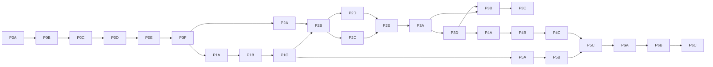

# CodeWithMee Complete Implementation Plan

**Status:** Ordered implementation roadmap  
**Audit date:** 2026-07-31  
**Scope:** Phase 0 through Phase 6; no production feature was implemented by this audit

## 1. How to execute this roadmap

Every implementation item has a stable identifier. Do not renumber completed identifiers; if scope is added, append a new identifier within the owning subphase. A Codex run should select only items whose dependencies are complete, update tests/docs with the code, and leave a short evidence note (commit, test command, migration, screenshot, or deployed check) beside the tracker maintained in the future.

The target architecture is defined in `ARCHITECTURE.md`; data, endpoints, security, and deployment contracts are defined in the corresponding plan documents. If implementation evidence requires a design change, write an architecture decision record before changing cross-phase contracts.

### Dependency spine

Some UI work can overlap after its data/policy contract is fixed, but phase acceptance gates remain sequential. Phase 6 deployment manifests begin in Phase 0 and are finalized in Phase 6; this is not a license to deploy insecure intermediate features publicly.

## 2. Order changes and rationale

1. **Provider identity/roles start in Phase 0B, not Phase 2.** The repository uses separate `User` and `Company` credentials and trusts `accountType`; pending companies can publish. A unified user + organization membership model is an authentication/authorization repair and a prerequisite for every provider permission.
2. **Database normalization and object storage start in Phase 0C.** Continuing to add embedded progress, comments, files, grading, payments, and ideas to current Mongo documents would require later migration and redesign. The prototype stage is the safe migration point.
3. **The secure execution plane is built in Phase 1B before Phase 5.** Challenges provide the smallest contract with which to prove isolation, quotas, result redaction, and operations. The multi-file IDE then reuses that proven plane.
4. **Course/progress foundations begin with first-party learning in Phase 1C.** Phase 2 extends the same versioned model to provider authoring; it does not create a second LMS.
5. **Moderation and blocking finish before public Creative Space and repository generation.** Those later features add private files, collaboration, AI output, and external links that require the trust/safety primitives.
6. **Production deployment is formalized in Phase 6, but deployability is tested from Phase 0.** CI, configuration, health, migrations and staging cannot be postponed to the end.

---

# Phase 0 — Repository stabilisation

## Phase 0A — Baseline, build system, and configuration

1. **Objective:** Establish a reproducible, supportable workspace without changing product behavior, preserve the current dirty-tree snapshot, migrate CRA to Vite/TypeScript incrementally, and remove hard-coded environment assumptions.
2. **Existing functionality that can be reused:** React components/pages, Express routes, current package lockfiles, working production client build, Monaco integration, CSS assets, README setup concepts.
3. **Missing functionality:** Root scripts/workspaces, environment schema, supported Node version, typed contracts, clean lint gate, production API base configuration, dependency ownership, reproducible clean install.
4. **Dependencies:** None. This is the entry gate; record the current working tree before any move.
5. **Database changes:** None beyond adding configuration placeholders; no data migration in this subphase.
6. **Backend changes:** Split `app` from `listen`, introduce typed config validation, standard scripts, and supported runtime policy without changing endpoint behavior.
7. **Frontend changes:** Create Vite/TypeScript shell, move pages feature-by-feature, centralize API client/config, preserve visual parity, remove `react-app-rewired`/Prism Babel coupling.
8. **Security requirements:** Never copy `.env`; no key values in logs; deterministic installs; remove unused vulnerable execution dependencies only after reference scan; record existing uploaded media without exposing it.
9. **Testing requirements:** Clean install/build on supported Node LTS, old/new client parity smoke, server syntax/type check, zero unexpected generated diffs.
10. **Deployment impact:** Produces deployable artifacts and environment-variable contract; does not deploy publicly.
11. **Expected files or modules affected:** root `package.json`, lockfile/workspace config, `client/` migrating to `apps/web/`, `server/` migrating to `apps/api/`, `packages/config/`, `.env.example`, README, CI skeleton.
12. **Acceptance criteria:** One root command installs, lints, tests and builds; API host is configuration-driven; Vite bundle renders all current routes; supported Node version is enforced; current uncommitted user changes are preserved.
13. **Risks:** Large move obscures behavior changes; React/Router/CRA compatibility differences; lockfile churn; accidental overwrite of user work.
14. **Safe fallback:** Keep `client/` and `server/` paths, add root scripts/config first, and migrate Vite in-place behind a temporary `client-vite` build until parity passes.
15. **Definition of completion:** Items below and acceptance checks pass on a clean checkout, with migration/rollback notes committed.

Implementation items:

- `P0A-S1` Capture `git status`, tracked/untracked upload manifest, runtime/package versions, baseline build/lint/test outputs, and a no-overwrite migration checklist.
- `P0A-S2` Add root workspace scripts, Node LTS pin, deterministic install/build/typecheck/lint/test commands, and consistent formatter/linter configuration.
- `P0A-S3` Migrate the client to Vite + TypeScript incrementally while preserving routes/styles and replacing the Babel Prism override.
- `P0A-S4` Introduce one typed API client and environment schema; replace all 99 literal `http://localhost:5001` references.
- `P0A-S5` Inventory/remove unused dependencies and update direct dependencies; specifically remove unused `vm2`, `python-shell`, `piston-client`, duplicate AI SDK, and obsolete CRA chain when verified.
- `P0A-S6` Split API construction from startup, add dev/test scripts and update setup/troubleshooting documentation.

## Phase 0B — Unified authentication and authorization foundation

1. **Objective:** Replace separate learner/company authentication and stale JWT account typing with one identity, secure sessions, platform roles, organizations and memberships.
2. **Existing functionality that can be reused:** Local bcrypt login/register UX, Google login button, JWT middleware concept, user/company profile screens, admin role concepts, company approval UI.
3. **Missing functionality:** Email verification/reset implementation, secure refresh rotation, session management, organization membership roles, approval enforcement, CSRF/origin controls, extension-ready OAuth foundation, account status enforcement.
4. **Dependencies:** `P0A-S1` through `P0A-S6`; database tables land with Phase 0C but contract/schema design is fixed here.
5. **Database changes:** `users`, `auth_identities`, `sessions`, verification/reset tokens, organizations, memberships, invitations, provider reviews, OAuth clients/codes.
6. **Backend changes:** Argon2id local auth, Google code flow, access/refresh lifecycle, session revocation, policy engine, organization context, bootstrap process for first superadmin.
7. **Frontend changes:** In-memory access token/session restoration, verification/reset/session pages, unified provider switcher, role-aware navigation for UX only.
8. **Security requirements:** HttpOnly rotating refresh cookies, short access tokens, generic login errors, rate limits, recent auth, no placeholder Google password, no self/last-owner/admin lockout, current role lookup.
9. **Testing requirements:** Auth/session unit/integration suite; token reuse, expiry, revocation, Google state/nonce, CSRF, banned status, role hierarchy, cross-tenant IDOR and browser session tests.
10. **Deployment impact:** Requires TLS, cookie/origin configuration, Google redirect URIs, email provider for full flow; staged migration invalidates or converts current JWTs.
11. **Expected files or modules affected:** `server/routes/auth.js`, `server/middleware/authMiddleware.js`, `server/models/User.js`, `Company.js`, `CompanyEmployee.js`, client auth context/pages, new `identity/`, `organizations/`, `policies/` modules.
12. **Acceptance criteria:** One user can be learner plus provider staff; pending provider cannot publish; platform/admin and org roles are server-enforced; logout/revoke works; no bearer token persists in localStorage.
13. **Risks:** Account collisions between company admin email and user email; session migration logs users out; cookie configuration differs locally and deployed.
14. **Safe fallback:** Require all users to sign in again; create provider-claim invitations for ambiguous company records; keep local-only bearer compatibility behind a time-limited flag, never in production.
15. **Definition of completion:** Unified identity is authoritative, compatibility JWTs are removed, auth threat-model tests pass, and role matrix in `SECURITY_PLAN.md` is enforced.

Implementation items:

- `P0B-S1` Define identity/session/organization/role contracts and permission matrix, including platform and course-scoped roles.
- `P0B-S2` Implement local and Google identities, verification/reset, short access tokens and rotating hashed refresh-token families.
- `P0B-S3` Implement organization creation, membership/invitation, provider verification state and pending/approved policy.
- `P0B-S4` Replace `accountType` checks with authentication + centralized policy middleware loading current status/roles.
- `P0B-S5` Migrate web auth state, add verification/reset/session management UX and remove localStorage tokens/legacy `x-auth-token` use.
- `P0B-S6` Create audited superadmin bootstrap and safe role/ownership change workflows.

## Phase 0C — Database consistency, migrations, and object storage

1. **Objective:** Establish normalized PostgreSQL as the authoritative store, migrate current MongoDB/file data repeatably, enforce invariants, and eliminate durable local uploads.
2. **Existing functionality that can be reused:** Domain concepts in nine Mongoose models, current upload metadata/paths, data already stored in Mongo, TTL cache idea.
3. **Missing functionality:** Schema migrations, constraints, transactions, bounded tables, file ownership/scanning, data parity scripts, backups, rollback/cutover plan.
4. **Dependencies:** Phase 0A; Phase 0B identity contracts. Must precede new Phase 1-5 persistence.
5. **Database changes:** Full baseline in `DATABASE_PLAN.md`, Prisma migrations, indexes, audit/idempotency/outbox tables, import provenance.
6. **Backend changes:** Repository layer, transactional services, file service/presigned URLs, Mongo read adapter only during migration, no direct ORM serialization.
7. **Frontend changes:** Upload-intent/direct-upload flow and stable IDs/DTOs; otherwise behavior parity.
8. **Security requirements:** Private buckets, checksum/type/scan state, least-privilege DB roles, encrypted backups, no path-derived authorization, no deletion of source before rollback window.
9. **Testing requirements:** Fresh/upgrade migrations, constraint/invariant tests, repeatable migration with checksums, orphan/dangling reference fixtures, object upload/download authorization.
10. **Deployment impact:** Adds PostgreSQL, object storage, migration job and backup target; requires short write freeze for final cutover.
11. **Expected files or modules affected:** all `server/models/*`, services/routes, `prisma/`, `scripts/migrate-mongo-to-postgres/`, file/storage infrastructure, upload components, deployment config.
12. **Acceptance criteria:** Counts/checksums/owners reconcile; no production Mongoose write; no durable API filesystem upload; constraints prevent duplicate enrollment/follow/reaction and invalid ownership.
13. **Risks:** Ambiguous company/user mapping, exposed legacy hidden cases, string/ObjectId mismatch in social data, orphan uploads, source downtime.
14. **Safe fallback:** Quarantine ambiguous rows/files and surface an operator report; mark legacy challenge tests visible; retain read-only Mongo/upload snapshot and rollback feature flag.
15. **Definition of completion:** PostgreSQL/object storage are authoritative, migration and restore evidence exists, source snapshot is retained per policy, and parity exceptions are explicitly resolved/quarantined.

Implementation items:

- `P0C-S1` Implement Prisma baseline migrations, constraints, indexes, seed roles/permissions and migration CI.
- `P0C-S2` Build repeatable Mongo inventory/export/import scripts with provenance, checksums, exception reports and dry-run mode.
- `P0C-S3` Implement private S3-compatible file records, presigned upload/authorized download, scan/quarantine states and lifecycle cleanup.
- `P0C-S4` Normalize/migrate identity, roadmaps, progress, notes/chat, challenges, courses/enrollments, posts/comments/projects and caches.
- `P0C-S5` Run rehearsal/parity reports, execute domain cutovers with feature flags, document write freeze and rollback.
- `P0C-S6` Add backup exports, restore smoke test, orphan reconciliation and post-cutover removal plan for Mongoose/local serving.

## Phase 0D — Versioned API, validation, errors, logging, and security controls

1. **Objective:** Make every API route predictable, validated, least-privileged, observable, rate-limited and safe to expose.
2. **Existing functionality that can be reused:** Express 5 router layout, some express-validator rules, per-route auth middleware, existing messages and route concepts.
3. **Missing functionality:** `/api/v1`, OpenAPI, strict schemas, centralized error/async handling, DTO redaction, CORS/headers/rate limits, correlation/audit logging, idempotency/outbox, sanitization.
4. **Dependencies:** Phase 0B policies and Phase 0C repositories.
5. **Database changes:** audit events, idempotency keys, outbox/job rows; no feature-domain expansion.
6. **Backend changes:** module route/controller/service/repository separation, problem-details errors, request IDs, structured logger, security middleware, strict body limits, health/readiness.
7. **Frontend changes:** generated/shared contracts, one API error model, cancellation/retry rules, safe sanitized renderer, no alert-only critical errors.
8. **Security requirements:** exact CORS, CSP/security headers, CSRF/origin controls, field allowlists, XSS sanitization, sensitive-log redaction, per-class rate limits, secret validation.
9. **Testing requirements:** OpenAPI/contract tests, unknown-field/size fuzzing, DTO leak snapshots, XSS corpus, CORS/CSRF/rate-limit, log-redaction and idempotency tests.
10. **Deployment impact:** Requires shared rate-limit store for multiple replicas eventually; structured telemetry sink; readiness replaces “listen without DB.”
11. **Expected files or modules affected:** every route, `middleware/`, `contracts/`, API client, sanitizer/renderers, `server/index.js`, config/logging, OpenAPI files.
12. **Acceptance criteria:** All 88 legacy routes are mapped, migrated, tombstoned or assigned to an explicit replacement phase; obsolete credential/header compatibility is removed; every v1 route has schema/policy/DTO/rate class; no stack/secret/private field leakage; readiness fails correctly.
13. **Risks:** Compatibility break for current UI; overaggressive sanitization; inconsistent error mapping; rate limits blocking tests.
14. **Safe fallback:** Run old/v1 adapters in parallel for one release with telemetry and expiry date; render plaintext where rich-content safety is uncertain; use conservative local in-memory limits only for single-instance dev.
15. **Definition of completion:** OpenAPI and security/contract gates pass; obsolete credential/header compatibility is removed; every retained feature route has a tested versioned replacement owner and global cutover kill switch; logs/errors/health behave correctly. Final deletion of active unversioned feature routes follows their Phase 1–4 replacements because deleting them here would break the current client; this dependency-driven order supersedes the original all-routes-in-Phase-0D wording.

Implementation items:

- `P0D-S1` Define OpenAPI 3.1 `/api/v1`, strict runtime schemas, DTOs, cursor/revision/idempotency and problem-details conventions.
- `P0D-S2` Refactor routes into modules with centralized async error handling, correlation IDs, structured redacted logging and readiness.
- `P0D-S3` Add exact CORS, CSRF/origin defense, security headers/CSP, route body limits and rate-limit classes.
- `P0D-S4` Replace AI/note/raw rich HTML rendering with restricted Markdown/document model plus audited sanitizer.
- `P0D-S5` Add policy and response-redaction tests for every resource and sensitive field family.
- `P0D-S6` Add audit/idempotency/outbox primitives and decommission legacy route/header compatibility.

## Phase 0E — Responsive frontend, accessibility, and abandoned-function cleanup

1. **Objective:** Produce a coherent responsive shell and remove broken, duplicate, misleading, unlicensed or abandoned functionality before feature growth.
2. **Existing functionality that can be reused:** Animated theme, header/profile controls, responsive CSS already present on many pages, Monaco mobile rules, dashboard cards, custom dropdown, error boundary, mobile warning as temporary messaging.
3. **Missing functionality:** Consistent design primitives, account/role guards, 360 px coverage, keyboard/focus/semantics, route loading/error/empty states, accessible rich controls, feature inventory and product copy accuracy.
4. **Dependencies:** Phase 0A client foundation and Phase 0D contracts/errors.
5. **Database changes:** None; feature flags may be stored in operations tables.
6. **Backend changes:** Remove/deprecate unused endpoints only after usage map; support capability/config endpoint if UI needs feature availability.
7. **Frontend changes:** Responsive navigation, tables/cards/forms/modals/editor modes, a11y primitives, error/loading skeletons, route-level role UX, reduced motion, no blocking “desktop recommended” substitute for responsiveness.
8. **Security requirements:** No authorization reliance on route guards; external URL/image handling through safe components; do not expose private data in error/empty states.
9. **Testing requirements:** Component tests, axe checks, keyboard flows, Playwright at 360/390/768/1024/1440, reduced motion, slow/error network and browser matrix.
10. **Deployment impact:** Potential asset size reduction and better mobile performance; no new service.
11. **Expected files or modules affected:** `client/src/App.js`, header/dropdowns/error boundary, every page/CSS file, `MobileWarningOverlay`, global theme/design tokens, media assets.
12. **Acceptance criteria:** All supported learner/provider/admin routes work at 360 px without inaccessible controls; keyboard navigation/focus pass; misleading stubs are hidden/removed; responsive E2E passes.
13. **Risks:** Visual regression; removing a user-valued experiment; large CSS rewrite; animation performance.
14. **Safe fallback:** Feature-flag incomplete pages as internal preview; use simple stacked/tabs mobile layout; retain an archived branch/tag for removed experiments, not dead production imports.
15. **Definition of completion:** UI inventory is resolved, mobile/a11y gates pass, no known dead import/route or “coming soon” action is presented as working, and key pages meet performance budgets.

Implementation items:

- `P0E-S1` Create accessible design tokens/primitives and consistent app shell/navigation/loading/error/empty states.
- `P0E-S2` Make auth, dashboard, pathways, sandbox, challenges, courses, Space, provider and admin routes responsive from 360 px.
- `P0E-S3` Implement keyboard, focus, semantics, reduced-motion, contrast, media caption/transcript and axe fixes.
- `P0E-S4` Inventory each component/route/endpoint; remove or feature-flag duplicate, deleted, legacy and placeholder functionality.
- `P0E-S5` Review the commercial promo media and tracked user uploads for license/privacy; create an approved migration/remediation plan without silently deleting user data.
- `P0E-S6` Add visual/responsive/accessibility regression scenarios and performance budgets.

## Phase 0F — Testing, CI, observability, and Phase 0 release gate

1. **Objective:** Replace the current zero-test state with a trustworthy automated foundation and a staging quality gate.
2. **Existing functionality that can be reused:** Testing Library dependencies, CRA Jest conventions as test content inspiration, current successful build command, manual route behavior.
3. **Missing functionality:** Test runner configuration, fixtures/factories, integration DB, API tests, E2E, coverage thresholds, CI, security scans, telemetry, deployment smoke.
4. **Dependencies:** Phase 0A-E complete enough to test stable contracts.
5. **Database changes:** Test factories/seed data and isolated test databases; telemetry/audit records already planned.
6. **Backend changes:** Dependency injection/test app, deterministic external-provider fakes, telemetry instrumentation and graceful shutdown.
7. **Frontend changes:** API mocking and stable selectors/accessibility queries; error boundary/retry observability.
8. **Security requirements:** Test secrets only, no production data; CI least privilege; fork PRs never use privileged runners; secret/dependency/SAST scans.
9. **Testing requirements:** Unit, API integration, Postgres constraints, contract/redaction, Playwright critical flows, migration, load-smoke and failure-injection; meaningful coverage thresholds by module.
10. **Deployment impact:** Adds CI, staging, telemetry and synthetic health checks; artifacts are immutable and scanned.
11. **Expected files or modules affected:** test configs/factories, `*.test.*`, Playwright, CI workflows, telemetry modules, Docker compose/testcontainers, staging deployment descriptors.
12. **Acceptance criteria:** Test command exits 0 with real tests; lint has zero warnings; CI blocks contract/security/migration failures; staging smoke and telemetry correlation work.
13. **Risks:** Brittle UI tests; slow CI; false-positive scanners; coverage without useful assertions.
14. **Safe fallback:** Prioritize auth/authorization/data/redaction/runner contract and five critical E2E flows; quarantine flaky tests with owner/expiry, never silently skip security tests.
15. **Definition of completion:** Phase 0 gate in `SECURITY_PLAN.md` passes and the repository can safely begin new feature implementation.

Implementation items:

- `P0F-S1` Configure unit/component/API test runners, factories and deterministic fakes for AI, video, email, storage and runner.
- `P0F-S2` Add PostgreSQL integration/constraint/migration tests and isolated per-run data lifecycle.
- `P0F-S3` Add Playwright auth, responsive navigation, profile, challenge-read and provider-role smoke flows.
- `P0F-S4` Add CI formatting/lint/type/build/test/OpenAPI/dependency/license/secret/SAST/container gates.
- `P0F-S5` Instrument OpenTelemetry-style requests/jobs, error reporting, health/synthetic checks and redaction.
- `P0F-S6` Publish Phase 0 evidence report and block Phase 1 until acceptance/security gates pass.

---

# Phase 1 — Core learning and challenges

## Phase 1A — Challenge content, catalog, starter code, and seed set

1. **Objective:** Deliver a responsive challenge catalog and solver contract with versioned statements, difficulty/tags, language-correct starter files, visible examples and reviewed seed content.
2. **Existing functionality that can be reused:** Challenges/CreateChallenge/ChallengeSolver UI, Monaco, difficulty/tags/score, visible flag, likes/comments, boilerplate concept, challenge list/search/filter styles.
3. **Missing functionality:** Immutable versions, safe learner DTO, language-specific starter execution contract, moderation/publishing, deterministic checker specs, quality seed set, pagination.
4. **Dependencies:** Phase 0 complete, especially DTO redaction, PostgreSQL and responsive shell.
5. **Database changes:** challenges, versions, tags, starter files, visible/hidden cases and publishing metadata from `DATABASE_PLAN.md`.
6. **Backend changes:** authoring/publish validation, learner/manager DTOs, catalog search/cursors, starter manifest, checker contract; no direct execution yet.
7. **Frontend changes:** responsive catalog filters/cards/table, complete statement/constraints/examples, language selector, multi-file-ready starter load, clear run/submit states.
8. **Security requirements:** Never serialize hidden/reference/checker data; only authorized authors manage tests; sanitize statements; starter paths normalized.
9. **Testing requirements:** DTO leak tests, publish validation, starter language snapshots, catalog pagination/filter, responsive/accessibility, seed solution/case validation against future runner fixtures.
10. **Deployment impact:** Database growth is small; no runner capacity until 1B; seed migration required.
11. **Expected files or modules affected:** challenges DB/API module, challenge web feature, seed scripts, OpenAPI/contracts, legacy Challenge model/routes/pages retired.
12. **Acceptance criteria:** Catalog/solver works at mobile/desktop; each published seed has at least one visible and multiple hidden tests, reviewed solutions and correct starter; learner APIs contain no secret case data.
13. **Risks:** Poor test data, ambiguous stdin/function contract across languages, user-authored malicious content, version confusion.
14. **Safe fallback:** Launch a curated Python/JavaScript seed subset using stdin/stdout only; defer community authoring and extra languages until runner validation.
15. **Definition of completion:** Reviewed seed challenges and authoring/publishing workflow pass content, contract, accessibility and secret-redaction gates.

Implementation items:

- `P1A-S1` Implement versioned challenge/tag/starter/test schema and learner/author DTOs.
- `P1A-S2` Define stdin/stdout, function-harness and checker contracts per supported language; start with Python/JavaScript.
- `P1A-S3` Build draft/edit/review/publish/retire authoring flow with test classification and validation.
- `P1A-S4` Build responsive searchable catalog with difficulty, tags, solved/saved status and cursor pagination.
- `P1A-S5` Build solver statement/examples/starter-language UX with explicit visible versus hidden behavior.
- `P1A-S6` Seed and review an initial challenge set; run every reference solution and negative fixture through the runner test harness before publish.

## Phase 1B — Secure Run Code, Submit Code, hidden tests, and history

1. **Objective:** Prove the isolated execution plane and deliver reliable run/submit with hidden-test redaction and durable submission history.
2. **Existing functionality that can be reused:** Piston request/response knowledge, language map, Monaco source, output panel, Run/Submit buttons, current result formatting.
3. **Missing functionality:** Private gateway, authentication/signatures, pinned runtimes, queue/admission control, timeouts/quotas, durable submissions/case results, idempotency, circuit breaker, hidden redaction.
4. **Dependencies:** Phase 1A published challenge versions; Phase 0 jobs/idempotency/logging/security.
5. **Database changes:** submissions, case results, execution jobs, challenge solutions and runtime/version snapshots.
6. **Backend changes:** execution service/gateway adapter, run-visible/custom input, submit-hidden, async status, verdict normalization, scoring transaction, history APIs.
7. **Frontend changes:** queued/running/result states, cancel/retry policy, visible output, redacted hidden summary, history/detail pages and limits messaging.
8. **Security requirements:** full runner requirements in `SECURITY_PLAN.md`; no DB/app secrets; network off; pinned runtime; hard resource/output limits; signed non-replay jobs; per-user/org/IP quota.
9. **Testing requirements:** reference/wrong/compile/runtime/timeout/OOM cases, hidden leak corpus, duplicate submit, concurrency/load, runner escape/DoS/network/cross-job tests, circuit-breaker failures.
10. **Deployment impact:** Requires paid isolated Linux runner capacity for a real hosted release; free hosted demo must use fallback.
11. **Expected files or modules affected:** execution and submissions API modules, gateway/runner app/infra, worker/queue, challenge solver/history UI, telemetry/alerts.
12. **Acceptance criteria:** Run uses only visible/custom input; Submit runs hidden suite; repeated request does not double-score; history is durable; runner compromise cannot reach trusted credentials/network.
13. **Risks:** Sandbox escape, capacity cost/abuse, runtime nondeterminism, long queue, hidden leakage through errors/timing/logs.
14. **Safe fallback:** Disable hosted execution and show local-run instructions/read-only examples; do not run code in Express, `vm2`, `python-shell`, or a shared shell.
15. **Definition of completion:** Phase 1 runner security gate, capacity smoke, redaction tests and end-to-end submission/history acceptance all pass.

Implementation items:

- `P1B-S1` Build private execution gateway and pinned Piston/Isolate runner image with signed job/result protocol.
- `P1B-S2` Implement durable execution jobs, admission control, concurrency/CPU budgets, timeouts, circuit breaker and observability.
- `P1B-S3` Implement Run Code for visible examples/custom input with learner-safe compiler/runtime output.
- `P1B-S4` Implement Submit Code against immutable hidden suite, transactional scoring/solution state and strict redaction.
- `P1B-S5` Implement paginated submission history/detail, filters and solver result/history UX.
- `P1B-S6` Complete adversarial sandbox, leak, idempotency, failure and load tests; document paid capacity/fallback.

## Phase 1C — Video, lesson, module and course progress with cross-device resume

1. **Objective:** Provide authoritative first-party learning progress and resume playback that Phase 2 provider courses can reuse.
2. **Existing functionality that can be reused:** Sandbox YouTube player/search, current video timestamp/duration save and resume overlay, roadmap topics/completion, course progress UI prototype.
3. **Missing functionality:** Lesson-scoped video identity, completion policies, watched intervals, module/course derivation, revision/conflict sync, progress reconciliation, first-party content version entitlement.
4. **Dependencies:** Phase 0 course/progress schema foundation and Phase 1A/B challenge completion events.
5. **Database changes:** first-party course versions/modules/lessons/enrollments, lesson/video progress, derived module/course snapshots and activity events.
6. **Backend changes:** progress policy engine, throttled monotonic video updates, challenge/quiz hooks, derive/reconcile jobs, progress/read APIs with revisions.
7. **Frontend changes:** course/lesson navigator, progress bars, resume card/overlay, debounced saves, offline/error indication, cross-tab/device revision conflict handling.
8. **Security requirements:** User must own enrollment; validate lesson belongs to enrolled version; clients cannot set percent/completion directly; do not infer completion solely from duration sent by client.
9. **Testing requirements:** spoofed IDs/durations, rewind/seek/complete policies, concurrent devices, retry/idempotency, version changes, derived progress invariants, mobile player E2E.
10. **Deployment impact:** More frequent writes; requires throttling, indexes and background reconciliation; still free-tier feasible for a small beta.
11. **Expected files or modules affected:** learning/progress/course DB/API modules, Sandbox/Pathways/Courses migration, player adapter, worker events, dashboard resume widgets.
12. **Acceptance criteria:** Resume within configured tolerance on another device; lesson/module/course progress derives correctly; failed writes are visible/retried; challenge completion contributes only when policy requires it.
13. **Risks:** Excess write volume, inaccurate third-party player events, multi-device last-write loss, course edits invalidating progress.
14. **Safe fallback:** Store last position and explicit completion only, with version/revision and manual “mark complete”; do not claim robust watched-percentage analytics until player events are validated.
15. **Definition of completion:** First-party seed course end-to-end progress/resume/sync and reconciliation tests pass, and Phase 2 can author against the same contracts.

Implementation items:

- `P1C-S1` Implement versioned first-party course/module/lesson and enrollment foundation with completion-policy schema.
- `P1C-S2` Implement lesson-scoped video source/progress, watched interval policy, resume and revision-aware update API.
- `P1C-S3` Implement lesson completion evaluation and derived module/course snapshots/reconciliation.
- `P1C-S4` Integrate challenge solution and other required lesson events into progress policy.
- `P1C-S5` Build responsive learner navigator, resume playback, progress dashboards and cross-device conflict/error UX.
- `P1C-S6` Add concurrency/spoofing/version/performance tests and progress reconciliation telemetry.

# Phase 2 — Course-provider LMS

## Phase 2A — Provider tenancy, roles, permissions, and dashboard

1. **Objective:** Let approved organizations operate isolated provider workspaces with least-privilege staff access and an actionable dashboard.
2. **Existing functionality that can be reused:** Company signup/login, admin approval page, CompanyEmployee records, provider navigation, course/stat/enrollment dashboard prototypes.
3. **Missing functionality:** Unified identities, organization memberships, scoped roles, invitations, server-enforced approval, staff lifecycle, audit trail and trustworthy dashboard queries.
4. **Dependencies:** Phase 0B identity/organization authorization and Phase 0C relational migration must be complete.
5. **Database changes:** Use organizations, organization_memberships, membership_invites, organization_audit_events and provider aggregate tables/materialized views.
6. **Backend changes:** Membership/invite APIs, policy middleware, organization context resolution, approval/publish gates, dashboard aggregates and audit writes.
7. **Frontend changes:** Organization switcher, dashboard, staff/invite management, role editor, approval state and permission-aware navigation/actions.
8. **Security requirements:** Every provider query is organization-scoped; only owners/admins manage staff; instructors cannot grant privilege; suspended/unapproved providers cannot publish; never trust client role state.
9. **Testing requirements:** Role matrix integration tests, cross-tenant IDOR corpus, invite expiry/replay, suspension/revocation, aggregate correctness and dashboard accessibility/responsiveness.
10. **Deployment impact:** Email is needed for staff invites; aggregate jobs can initially use the database/outbox worker; small beta remains free-tier feasible.
11. **Expected files or modules affected:** Identity/organization API and DB modules, policy layer, provider shell/dashboard/staff pages, email templates, worker aggregates and audit log.
12. **Acceptance criteria:** An approved provider can invite and manage staff within allowed roles; every forbidden cross-tenant request is denied; dashboard totals reconcile with source records.
13. **Risks:** Role sprawl, stale authorization caches, accidental cross-tenant data exposure and ambiguous ownership transfer.
14. **Safe fallback:** Offer only owner and instructor roles at launch, with support-assisted ownership transfer, until fine-grained permissions are proven.
15. **Definition of completion:** The documented provider-role matrix, tenant-isolation suite, invitation lifecycle and dashboard reconciliation tests pass.

Implementation items:

- `P2A-S1` Implement organization context, membership roles and resource-action policy checks across provider APIs.
- `P2A-S2` Implement provider approval, suspension and publishing gates with immutable audit events.
- `P2A-S3` Implement staff email invitations, acceptance, expiry, resend, revocation and membership lifecycle.
- `P2A-S4` Build responsive provider dashboard with scoped course, learner, submission and grading aggregates.
- `P2A-S5` Build staff/role management UI and complete tenant-isolation, authorization and audit tests.

## Phase 2B — Versioned course authoring and media/resources

1. **Objective:** Deliver a safe course builder for modules, lessons, video, external links, notes and downloadable resources with explicit publishing/version semantics.
2. **Existing functionality that can be reused:** Embedded Course modules/contents, create/edit forms, video/note/link/resource/practice/test types, public/private flag, allowDownload concept, course catalog/player UI.
3. **Missing functionality:** Relational versioned drafts, ordering, autosave/conflict control, preview, validation, immutable publication, secure file ownership/downloads, media processing and retirement.
4. **Dependencies:** Phase 2A permissions, Phase 0 object storage and Phase 1C learner progress/version contracts.
5. **Database changes:** Courses, course_versions, modules, lessons, content blocks, video assets, resources, file records, publish reviews and version migration policies.
6. **Backend changes:** Draft CRUD/reorder, optimistic revisions, preview/publish/retire, file presign/finalize, video metadata/transcode callbacks, learner DTOs and entitlement-aware downloads.
7. **Frontend changes:** Drag/reorder builder, lesson/content editors, video upload/external URL choice, note/resource manager, download controls, preview, validation and publish checklist.
8. **Security requirements:** Validate URLs and files; private object storage with short signed delivery; download permission enforced server-side; sanitize notes; published versions immutable; scan uploads.
9. **Testing requirements:** Builder CRUD/reorder/concurrent edit, publish validation, version immutability, private download denial, external URL allowlist/metadata, upload/scan failure and responsive authoring E2E.
10. **Deployment impact:** Object storage is required; self-hosted video uploads add transcoding/CDN cost and should not be part of the default free demo.
11. **Expected files or modules affected:** Course/catalog/content DB/API modules, provider course builder, learner player, files/media service, worker/transcode adapter and email/audit events.
12. **Acceptance criteria:** A permitted provider can draft, preview and publish an immutable version; learners receive only entitled content; resource downloads follow policy; old enrollments remain version-consistent.
13. **Risks:** Complex builder state, oversized media, copyright violations, version changes stranding progress and accidental publication of incomplete content.
14. **Safe fallback:** Launch with external YouTube/Vimeo links and small scanned documents; disable direct video upload/transcoding until paid media capacity and rights procedures exist.
15. **Definition of completion:** Course authoring, publish/version, learner delivery, entitlement and media/resource tests pass for public and private courses.

Implementation items:

- `P2B-S1` Implement course draft/version/module/lesson/content schema, revisions and deterministic ordering.
- `P2B-S2` Build responsive course/module/lesson builder with autosave conflict handling, preview and validation.
- `P2B-S3` Implement external video/link validation and provider-owned uploaded-media lifecycle.
- `P2B-S4` Implement sanitized notes, file resources and enforceable view/download permissions using private signed URLs.
- `P2B-S5` Implement immutable publish, retire and enrolled-version migration policy with audit history.
- `P2B-S6` Complete authoring, entitlement, upload, versioning and mobile learner delivery tests.

## Phase 2C — Quizzes, written answers, assignments, ZIP submissions, grading, and feedback

1. **Objective:** Add assessable lesson content with objective and written quizzes, file/ZIP assignments, controlled attempts, grading and learner feedback.
2. **Existing functionality that can be reused:** Course `test` content concept, challenge execution/validation services, enrollment/progress UI and generic upload patterns.
3. **Missing functionality:** Question bank, immutable assessment versions, attempts, server scoring, rubric/manual grading, assignment deadlines, secure submission storage, feedback/regrade and gradebook.
4. **Dependencies:** Phase 2B published lessons/files, Phase 1C progress policy and Phase 0 jobs/audit; automated code tasks depend on Phase 1B runner.
5. **Database changes:** Assessments, versions, questions/options, attempts/answers, assignments, submission versions/files, rubrics, grades, feedback, regrade requests and due-date accommodations.
6. **Backend changes:** Author/preview/publish assessments, start/save/submit attempts, server score objective items, assignment submission/finalize, grading queues, rubric/feedback/regrade and progress events.
7. **Frontend changes:** Quiz/written-answer builder and player, assignment brief/deadline, resumable file/ZIP submission, submission history, gradebook, rubric grading and feedback views.
8. **Security requirements:** Never expose answer keys before final policy permits; authorization-scoped grading; scan archives without unsafe extraction; reject zip-slip/bombs/executables by policy; signed private files and immutable grade audit.
9. **Testing requirements:** Answer-key leak, attempts/time/expiry, autosave/concurrency, deterministic scores, file and archive adversarial corpus, deadline/timezone, grading permissions, regrade and progress integration.
10. **Deployment impact:** Object storage, scanning workers and scheduled deadline jobs are required; large archive limits and retention raise paid-storage needs.
11. **Expected files or modules affected:** Assessment/assignment/grading DB/API modules, author/player/gradebook UI, file scanner, worker schedules, progress and notifications.
12. **Acceptance criteria:** Providers publish valid assessments/assignments; learners safely submit permitted answers/files; grades and feedback are durable/audited; progress follows configured completion policy.
13. **Risks:** Cheating/key exposure, destructive archives, inconsistent autosave, subjective grading disputes and storage abuse.
14. **Safe fallback:** Start with multiple-choice, short text and small PDF/ZIP uploads under strict limits; manual grading; defer online document editing and automated archive execution.
15. **Definition of completion:** Assessment, submission, grading, feedback, security and accessibility suites pass, including hidden-answer and hostile-file tests.

Implementation items:

- `P2C-S1` Implement versioned quiz/question/answer-key schemas and authoring/publish validation.
- `P2C-S2` Implement attempt lifecycle, objective scoring, written answers, autosave, limits and learner results policy.
- `P2C-S3` Implement versioned assignments, deadlines, rubrics, submission attempts and status transitions.
- `P2C-S4` Implement private file/ZIP uploads, scanning, safe inspection, quotas and retention without server-side arbitrary execution.
- `P2C-S5` Implement grader queues, gradebook, rubric scoring, feedback, release and regrade audit workflow.
- `P2C-S6` Integrate assessment outcomes with progress/notifications and complete adversarial/end-to-end tests.

## Phase 2D — Private access, invitations, enrollment, and manual QR-payment verification

1. **Objective:** Control private-course enrollment and support an auditable manual QR-payment flow without pretending to provide automated settlement.
2. **Existing functionality that can be reused:** Public/private and free/paid fields, enrollment records, provider enrollment table and enroll button.
3. **Missing functionality:** Course invitations, entitlement state machine, capacity/rules, payment orders, QR instructions, proof upload, reviewer decisions, expiry/refund/cancellation policy and email lifecycle.
4. **Dependencies:** Phase 2A roles/email, Phase 2B published courses, Phase 0 private files/idempotency/audit and Phase 2C notifications foundation where available.
5. **Database changes:** Course_invites, enrollment_requests, enrollment status/history, payment_orders, payment_proofs/files, payment_reviews, entitlements and provider payment settings.
6. **Backend changes:** Invite/request/accept/revoke, free enrollment transaction, payment-order creation, proof finalization, provider review approve/reject/request-more, entitlement grant/revoke and expiry jobs.
7. **Frontend changes:** Private invite landing, enrollment status, QR/payment instructions and proof upload; provider roster, invite and payment-review queues with audit details.
8. **Security requirements:** Unpredictable hashed invite tokens, one-time expiry, proof files private/scanned, no card/bank credential collection, reviewer separation where configured, idempotent entitlement grant and no client-declared payment success.
9. **Testing requirements:** Invite replay/forwarding/expiry, private IDOR, duplicate proof/review, concurrent approvals, rejected proof, revocation, email leakage and entitlement matrix.
10. **Deployment impact:** Transactional email, private storage and scheduled expiry jobs required; manual operation scales poorly and becomes paid staff/process cost.
11. **Expected files or modules affected:** Enrollment/payment/invite API and DB modules, learner checkout/status UI, provider roster/review UI, file service, emails, jobs and audit events.
12. **Acceptance criteria:** Private courses are inaccessible without valid entitlement; only a server-side reviewer approval grants paid enrollment; every state change is attributable and recoverable.
13. **Risks:** Fraudulent proof, privacy-sensitive payment images, slow human review, disputes, regional tax/accounting obligations and accidental double enrollment.
14. **Safe fallback:** Keep all courses free/invite-only or use a reputable hosted payment provider later; never automate QR-image interpretation as proof of settlement.
15. **Definition of completion:** The complete invitation/payment/enrollment state machine, audit trail, entitlement tests and operational review runbook pass.

Implementation items:

- `P2D-S1` Implement private-course invites, requests, hashed tokens, expiry and entitlement checks.
- `P2D-S2` Implement enrollment/roster state machine, capacity rules, revoke/restore and version binding.
- `P2D-S3` Implement payment orders, provider QR instructions and private scanned proof uploads.
- `P2D-S4` Implement permissioned manual review with approve/reject/request-more and idempotent entitlement grant.
- `P2D-S5` Implement learner/provider email notifications, reminders, expiry and dispute/audit views.
- `P2D-S6` Complete invite, payment-race, file-privacy, fraud-control and entitlement E2E tests.

## Phase 2E — Learner progress analytics for providers

1. **Objective:** Give providers accurate, privacy-bounded course, lesson, assessment and learner analytics.
2. **Existing functionality that can be reused:** Provider count cards, enrollment/progress percentages, Phase 1C activity events and Phase 2 assessment grades.
3. **Missing functionality:** Defined event taxonomy, durable event ingestion, aggregates, cohorts/funnels, freshness indicators, filters, export and deletion/backfill behavior.
4. **Dependencies:** Phase 1C progress, Phases 2B–2D domain events, organization policy and background jobs.
5. **Database changes:** Learning activity events, daily aggregates, course/lesson/learner fact tables or materialized views, export jobs/files and aggregate watermarks.
6. **Backend changes:** Transactional event/outbox ingestion, idempotent aggregation/rebuild, scoped dashboards, cursor drilldowns, privacy-aware export and freshness/quality endpoints.
7. **Frontend changes:** Provider analytics overview, completion/drop-off/assessment charts, learner drilldown, filters, freshness/empty/error states and asynchronous export download.
8. **Security requirements:** Organization/enrollment scope on all metrics; minimize personal data; audit exports; apply row/export limits; honor deletion/retention and do not expose private social activity.
9. **Testing requirements:** Aggregate reconciliation, late/duplicate events, backfill, cross-tenant isolation, export authorization, timezone boundaries, large dataset performance and chart accessibility.
10. **Deployment impact:** Small beta can aggregate in PostgreSQL worker; larger event volume needs paid compute, read replica/warehouse and controlled retention.
11. **Expected files or modules affected:** Analytics/event/outbox DB/API/worker modules, provider analytics pages, export files/jobs, telemetry and runbooks.
12. **Acceptance criteria:** Displayed totals reconcile to authoritative source data within declared freshness; filters/exports remain tenant-safe; backfill is idempotent.
13. **Risks:** Misleading metrics, event drift, expensive queries, privacy overreach and reporting load degrading learning paths.
14. **Safe fallback:** Ship nightly PostgreSQL aggregates and CSV export with visible “updated at”; defer real-time funnels and warehouse analytics.
15. **Definition of completion:** Taxonomy, aggregation, isolation, reconciliation, export and performance acceptance tests pass on representative data.

Implementation items:

- `P2E-S1` Define versioned learning-event taxonomy, producers, retention and privacy classification.
- `P2E-S2` Implement outbox ingestion, idempotent daily aggregates, watermarks and rebuild/backfill jobs.
- `P2E-S3` Build provider course/lesson/assessment/learner analytics with freshness and accessible charts.
- `P2E-S4` Implement audited asynchronous CSV export and deletion/retention propagation.
- `P2E-S5` Complete aggregate reconciliation, isolation and representative-volume performance tests.

# Phase 3 — The Space social platform

## Phase 3A — Profiles and relationship graph

1. **Objective:** Deliver privacy-safe profiles with both one-way follows and approval-based friend connections, including reliable blocking.
2. **Existing functionality that can be reused:** Profile editor/view, role badges, follower/following/request arrays, privacy flags, follow/request/block routes and UI prototypes.
3. **Missing functionality:** Minimal profile DTOs, normalized relationships, explicit friend semantics, transactional state transitions, discoverability settings, pagination and symmetric blocking cleanup.
4. **Dependencies:** Phase 0 identity/privacy/moderation primitives; public rollout should wait for Phase 3D reporting/moderation readiness.
5. **Database changes:** User_profiles, follows, friend_requests/connections, blocks, profile settings and relationship audit events with uniqueness/check constraints.
6. **Backend changes:** Public/profile-owner DTOs, follow/unfollow, request/accept/reject/remove, block/unblock transaction, paginated lists/search and visibility evaluator.
7. **Frontend changes:** Responsive profile, edit/privacy settings, follow/friend state actions, request inbox, connection lists and blocked-user management.
8. **Security requirements:** Never return email/auth/reset/notes/conversations/progress by profile API; blocking overrides every visibility/interaction; protect discovery endpoints and rate-limit graph actions.
9. **Testing requirements:** DTO allowlist snapshots, relationship transition/property tests, races, block cleanup, private profile matrix, enumeration limits and mobile/accessibility E2E.
10. **Deployment impact:** Relational graph remains PostgreSQL-friendly at beta scale; search/cache may become paid at high volume.
11. **Expected files or modules affected:** Profile/relationship DB/API modules, visibility policy, profile/search/request/settings UI, notifications and moderation hooks.
12. **Acceptance criteria:** Follow and friend behavior is unambiguous; private profiles disclose only allowed fields; blocking immediately removes access/interactions in both directions.
13. **Risks:** Harassment, enumeration, confusing follow/friend state, race duplicates and privacy regression.
14. **Safe fallback:** Launch one-way follows plus private-account approval; expose “friends” as accepted mutual follows only after product validation.
15. **Definition of completion:** Profile allowlist, relationship invariant, privacy, block and abuse-rate tests pass.

Implementation items:

- `P3A-S1` Implement minimal user-profile schema/DTOs, visibility settings and paginated discovery.
- `P3A-S2` Implement normalized follow/unfollow with private-account approval and transactional invariants.
- `P3A-S3` Implement explicit friend request/accept/reject/remove semantics and mutual-connection derivation.
- `P3A-S4` Implement symmetric block/unblock cleanup and a shared visibility/interaction policy service.
- `P3A-S5` Build profile, relationship, request and privacy UI; complete DTO/IDOR/race/mobile tests.

## Phase 3B — Posts, comments, reactions, media, and feed

1. **Objective:** Deliver a paginated, privacy-correct social feed for text/images, threaded discussion and reactions, with a bounded video path.
2. **Existing functionality that can be reused:** Space create/feed/post UI; Post schema/routes for text/media/comments/replies/reactions/saves/awards; upload handling and profile graph.
3. **Missing functionality:** Normalized interactions, cursor pagination/ranking, visibility snapshots/policy, media pipeline, edit/delete history, content state, anti-spam and scalable queries.
4. **Dependencies:** Phase 3A graph/visibility, Phase 0 private storage/jobs, and reporting hooks from Phase 3D before public release.
5. **Database changes:** Posts, post_media/files, comments with parent IDs, reactions, saves, post audience, edit history, moderation state and feed cursors/features.
6. **Backend changes:** Post/comment/reaction/save CRUD, media finalize, policy-filtered cursor feed, bounded fan-out/read ranking, edit/delete, counters and report hooks.
7. **Frontend changes:** Composer, image gallery, external-video embed or processed-video card, feed skeleton/error/empty states, comment threads, reaction picker and saved posts.
8. **Security requirements:** Sanitize text/metadata, scan media, strip EXIF where appropriate, MIME/signature/dimension limits, safe embed allowlist, block/private enforcement, CSP and anti-spam quotas.
9. **Testing requirements:** Visibility/blocked feed corpus, cursor consistency, concurrent reaction counters, recursive-comment limits, hostile image/video/embed, deletion/edit, N+1/performance and responsive accessibility.
10. **Deployment impact:** Text/images fit small free storage quotas; direct social video needs paid storage/transcoding/CDN/moderation. External allowlisted embeds are the launch choice.
11. **Expected files or modules affected:** Social/feed/comment/reaction DB/API modules, Space UI, media service/worker, cache/ranking adapter, moderation and notifications.
12. **Acceptance criteria:** Feed pagination is stable and policy-correct; comments/reactions are durable and deduplicated; unsafe/blocked/private media or posts never leak.
13. **Risks:** Toxic content, media cost/copyright, hot-feed queries, notification spam and count drift.
14. **Safe fallback:** Text, compressed images and allowlisted external video links only; chronological on-read feed with hard pagination and no autoplay.
15. **Definition of completion:** Social CRUD, privacy/moderation integration, media-security, feed correctness, accessibility and load gates pass.

Implementation items:

- `P3B-S1` Implement normalized posts, audience, edit history, media and lifecycle/moderation states.
- `P3B-S2` Implement bounded comment/reply threads, reactions and saves with transactional unique counters.
- `P3B-S3` Implement policy-filtered chronological cursor feed and paginated post/profile views without N+1 queries.
- `P3B-S4` Build responsive composer/feed/post/thread/reaction/save experiences.
- `P3B-S5` Implement scanned image delivery and allowlisted external-video embeds; document paid native-video gate.
- `P3B-S6` Complete visibility, media, counter-race, abuse, accessibility and feed-load tests.

## Phase 3C — Daily activity, streaks, comparisons, notifications, credits, and awards

1. **Objective:** Add motivating learning activity without client-trusted streaks, spammy notifications or farmable virtual credits.
2. **Existing functionality that can be reused:** Challenge solved/points state, social leaderboard/award prototype, user XP and course/challenge activity events.
3. **Missing functionality:** Daily challenge schedule, timezone policy, streak ledger, consented friend comparisons, notification inbox/preferences, immutable credit ledger, award catalog/grants and anti-abuse rules.
4. **Dependencies:** Phase 1 submission/progress events, Phase 3A graph, Phase 3B feed where activities are shared and Phase 0 outbox/jobs.
5. **Database changes:** Daily_challenges, streak_events/snapshots, notification/preferences/deliveries, credit_ledger/balances, award_definitions/grants and leaderboard periods.
6. **Backend changes:** Daily schedule jobs, authoritative qualification, streak recalculation, privacy-aware comparison queries, notification fan-out/read state, ledger transactions and award rule engine.
7. **Frontend changes:** Daily challenge card, streak calendar, friend comparison opt-in, notification center/preferences, credit history/balance and award gallery.
8. **Security requirements:** Server-originated idempotent earning events only; immutable ledger with reversal entries; caps/cooldowns; no reward for reversible spam; comparisons respect blocks/privacy; notification payload allowlists.
9. **Testing requirements:** Timezone/DST boundaries, late/duplicate events, streak rebuild, fraud/replay, ledger conservation, award uniqueness, privacy comparison and notification preference/deduplication tests.
10. **Deployment impact:** Scheduled jobs and notification/email volume grow with users; beta fits database/QStash-style limits, but reliable high-volume delivery needs paid queue/email.
11. **Expected files or modules affected:** Activity/streak/notification/credits/awards DB/API/worker modules, learner/social dashboard UI, email/push adapters and moderation hooks.
12. **Acceptance criteria:** Daily eligibility and streaks reproduce from source events; balances reconcile to ledger; users control notifications; comparisons never reveal blocked/private activity.
13. **Risks:** Gamification abuse, timezone disputes, noisy notifications, rank anxiety, transaction hot spots and rewards becoming financially regulated if transferable.
14. **Safe fallback:** Non-transferable cosmetic points, UTC daily windows with clearly displayed reset, in-app notifications only and weekly comparison snapshots.
15. **Definition of completion:** Replayable event, streak, ledger, preference, privacy and anti-abuse suites pass with documented product rules.

Implementation items:

- `P3C-S1` Implement daily challenge scheduling, eligibility and immutable qualification events.
- `P3C-S2` Implement timezone-aware streak event/snapshot/rebuild rules and learner streak UI.
- `P3C-S3` Implement opt-in privacy-aware friend comparisons and bounded leaderboards.
- `P3C-S4` Implement notification inbox, preferences, read state, outbox delivery and deduplication.
- `P3C-S5` Implement non-transferable credit ledger, balances, reversals, award definitions/grants and abuse caps.
- `P3C-S6` Complete timezone, replay, privacy, ledger-conservation and notification-load tests.

## Phase 3D — Reporting, blocking, and moderation operations

1. **Objective:** Provide the safety workflow required before broadly enabling social or public user-generated content.
2. **Existing functionality that can be reused:** Basic block route, post/user ownership checks, admin role and content records.
3. **Missing functionality:** Reports, reason taxonomy, evidence snapshots, moderation queue/cases/actions/appeals, automatic quarantine, moderator permissions, sanctions, audit and safety metrics.
4. **Dependencies:** Phase 0 admin/audit/security; integrate Phase 3A/B entities before their public launch and reuse for Phase 4.
5. **Database changes:** Reports, report_targets/evidence, moderation_cases/actions/notes, sanctions, appeals, content moderation state and safety aggregates.
6. **Backend changes:** Report intake/deduplication, risk routing, queue/search, action policy, quarantine/restore/remove, account restriction, appeal, evidence retention and audit APIs.
7. **Frontend changes:** Report dialogs, blocked-user view, moderator queue/case workspace, action confirmation, appeal/status and safety dashboards.
8. **Security requirements:** Reporter identity protected; least-privilege moderator scopes; immutable action audit; reason/evidence access controls; rate-limit malicious reports; no moderator access to unrelated private content.
9. **Testing requirements:** Report authorization/deduplication, block propagation across all modules, quarantine visibility, moderator matrix, audit immutability, appeal transitions, evidence privacy and abuse simulations.
10. **Deployment impact:** Requires operational on-call/moderation processes and retained evidence; tooling may be free-tier, but human moderation and advanced media safety are paid costs.
11. **Expected files or modules affected:** Moderation/report/sanction DB/API modules, shared content-state policy, social/creative UI hooks, moderator console, notifications and operational runbooks.
12. **Acceptance criteria:** Users can report/block safely; quarantined/removed content disappears consistently; authorized moderators resolve and audit cases; appeals follow a defined state machine.
13. **Risks:** Moderator abuse/bias, delayed response, evidence privacy, legal requests, coordinated false reporting and inconsistent enforcement.
14. **Safe fallback:** Invite-only community, text/images only, conservative quarantine thresholds and admin-only queue with strict audit until a moderation team exists.
15. **Definition of completion:** Safety policy, staffing/escalation runbook, moderation/appeal workflows and cross-module enforcement tests pass before public social launch.

Implementation items:

- `P3D-S1` Define community policy, report taxonomy, sanctions, appeals, evidence retention and moderator roles.
- `P3D-S2` Implement report intake, deduplication, target snapshots and risk-based case creation.
- `P3D-S3` Implement moderation queue/case APIs and audited quarantine/remove/restore/restrict actions.
- `P3D-S4` Build user report/status/appeal and moderator queue/case/audit interfaces.
- `P3D-S5` Apply block and moderation state consistently to profiles, feed, comments, media, search, notifications and Phase 4.
- `P3D-S6` Complete adversarial reporting, evidence privacy, moderator authorization and enforcement E2E tests plus incident drills.

# Phase 4 — Creative Space

## Phase 4A — Ideas, visibility, and collaborators

1. **Objective:** Turn the basic project post into a versioned idea workspace with private, friends-only and public access plus explicit collaborator roles.
2. **Existing functionality that can be reused:** Project title/description/tech stack/milestones/privacy/likes, user profiles and social navigation.
3. **Missing functionality:** Idea lifecycle, friends-only audience, ownership transfer, collaborator invitations/roles, workspace authorization, discovery and archive/delete behavior.
4. **Dependencies:** Phase 3A relationships/privacy and Phase 3D blocking/moderation; Phase 0 organization-style policy patterns and files.
5. **Database changes:** Ideas, idea_members, invitations, visibility, tags, status, idea audit events and saved/followed ideas.
6. **Backend changes:** Idea CRUD/publish/archive, audience policy, collaborator invite/accept/role/remove, ownership transfer, discovery/search and audit.
7. **Frontend changes:** Idea dashboard/editor/detail, visibility controls, collaborator panel/inbox, public/friends discovery and permission-aware states.
8. **Security requirements:** Central policy on every nested resource; friends visibility means active accepted connection and no block; collaborators cannot silently change visibility/ownership; sanitized content and audit.
9. **Testing requirements:** Visibility/role matrix, invitation replay, relationship changes, block propagation, ownership transfer, archive/delete, discovery privacy and mobile accessibility.
10. **Deployment impact:** Metadata is free-tier feasible; public discovery/search may later need paid search/cache.
11. **Expected files or modules affected:** Creative/idea/member DB/API modules, shared visibility policy, Creative Space pages, search, notifications and moderation integration.
12. **Acceptance criteria:** Ideas expose exactly the selected audience; collaborator capabilities match role; invitation and ownership transitions are atomic/audited.
13. **Risks:** Confidential idea leakage, collaborator conflict, ambiguous intellectual-property expectations and visibility drift after friendship changes.
14. **Safe fallback:** Private and public only, with owner/editor/viewer roles; introduce friends-only after graph-policy integration is proven.
15. **Definition of completion:** Idea lifecycle, audience, collaboration, blocking/moderation and authorization test matrices pass.

Implementation items:

- `P4A-S1` Implement idea lifecycle, visibility/status/tags and learner-safe discovery DTOs.
- `P4A-S2` Implement owner/editor/commenter/viewer collaborator memberships and invitation lifecycle.
- `P4A-S3` Implement private, friends-only and public policy with block/moderation propagation.
- `P4A-S4` Build responsive idea dashboard/editor/detail/discovery and collaborator experiences.
- `P4A-S5` Complete visibility, collaborator-race, ownership, moderation and mobile tests.

## Phase 4B — Idea artifacts, discussion, suggestions, voting, and history

1. **Objective:** Add the structured evidence and collaboration tools needed to move an idea from concept to prototype.
2. **Existing functionality that can be reused:** Project milestones and likes, social comment/reaction patterns, Phase 0 file records/storage and course resource controls.
3. **Missing functionality:** Notes, links, images/files, comments, structured suggestions, scoped votes, update history, repository/demo links and prototype submissions/versions.
4. **Dependencies:** Phase 4A authorization, Phase 0 file pipeline, Phase 3B interaction lessons and Phase 3D reporting/moderation.
5. **Database changes:** Idea_notes, links, attachments, discussions/comments, suggestions, suggestion_votes, updates/change log, prototype_submissions/files and external_link metadata.
6. **Backend changes:** Nested resource CRUD, suggestion state machine, unique vote transaction, append-only update timeline, link validation/preview, prototype version submit and file permissions.
7. **Frontend changes:** Workspace tabs, rich safe notes, link/resource gallery, discussion, structured suggestion/voting board, update timeline and prototype/repository/demo panels.
8. **Security requirements:** Nested authorization, sanitized rich text, scanned private files, URL allowlist/SSRF-safe preview worker, repository/demo scheme validation, no arbitrary ZIP execution and immutable history/audit.
9. **Testing requirements:** Nested IDOR, vote races/toggling, permission changes, hostile URLs/files/HTML, history accuracy, prototype versions, moderation/reporting and accessibility.
10. **Deployment impact:** File and preview worker/storage usage grows; free beta needs strict quotas and can omit automated previews.
11. **Expected files or modules affected:** Creative artifact/suggestion/update/prototype DB/API modules, file/preview services, workspace UI, notifications and moderation hooks.
12. **Acceptance criteria:** Authorized collaborators can attach, discuss, suggest, vote and submit versions; viewers see only allowed artifacts; history explains material changes without exposing secrets.
13. **Risks:** File malware, SSRF, vote manipulation, history bloat, external link rot and collaboration disputes.
14. **Safe fallback:** Plain-text notes, validated links without server previews, small image/PDF attachments and repository/demo URLs; defer ZIP prototype hosting.
15. **Definition of completion:** Nested authorization, artifact, suggestion/vote, history, prototype and hostile-input test suites pass.

Implementation items:

- `P4B-S1` Implement idea notes, validated links, scanned images/files and per-artifact permissions.
- `P4B-S2` Implement bounded comments/discussion with edit history, notifications, blocks and reporting.
- `P4B-S3` Implement structured suggestions, lifecycle, unique up/down votes and abuse controls.
- `P4B-S4` Implement append-only idea updates and human-readable history/audit views.
- `P4B-S5` Implement validated repository/demo links and versioned prototype submissions without executing uploaded code.
- `P4B-S6` Build integrated workspace UX and complete nested-IDOR, vote-race, file/link and moderation tests.

## Phase 4C — AI-generated idea blueprints

1. **Objective:** Generate useful, reviewable idea blueprints while protecting private context, controlling cost and preventing AI output from becoming trusted executable truth.
2. **Existing functionality that can be reused:** Gemini integration and chat UX, idea metadata, course/challenge architecture templates.
3. **Missing functionality:** Prompt contracts, explicit context consent, provider abstraction, job lifecycle, schema validation, citations/assumptions, versioning, quotas, safety filters and cost audit.
4. **Dependencies:** Phase 4A/B idea data and permissions, Phase 0 jobs/security, with Phase 5 consuming approved blueprint versions.
5. **Database changes:** Blueprint_requests, context manifests, blueprint_versions, structured sections, generation jobs, provider usage/cost and user feedback.
6. **Backend changes:** Context allowlist/redaction, queued generation, provider adapter, structured-schema validation/repair, version/save/apply, quotas, cancellation and audit.
7. **Frontend changes:** Consent/context picker, goals/constraints form, progress, structured preview/editor, assumptions/warnings, regenerate/compare/save and quota/error UI.
8. **Security requirements:** No secrets/private artifacts without explicit authorized selection; prompt-injection isolation; output escaped/sanitized; never auto-run commands or write repositories; per-user/org budgets and provider retention disclosure.
9. **Testing requirements:** Authorization/context leak, prompt injection, malformed/provider failure, schema repair, HTML/script output, retries/idempotency, cost quota and human-review workflow.
10. **Deployment impact:** AI calls and workers eventually require paid usage; free release may use bring-your-own-key or a tightly capped promotional quota.
11. **Expected files or modules affected:** AI/blueprint DB/API/worker modules, provider adapter/prompts/schema, Creative Space UI, usage/audit telemetry and Phase 5 contracts.
12. **Acceptance criteria:** A user explicitly selects context and receives an editable versioned blueprint matching a validated schema; private data and budgets remain bounded; nothing executes automatically.
13. **Risks:** Hallucinated architecture, prompt injection, private-data disclosure, unpredictable cost, provider outage and unsafe dependency recommendations.
14. **Safe fallback:** Deterministic questionnaire-driven blueprint templates with no external AI, or bring-your-own API key processed with explicit disclosure.
15. **Definition of completion:** Threat-model, context authorization, schema, quota, failure and human-review acceptance tests pass.

Implementation items:

- `P4C-S1` Define versioned blueprint schema, deterministic fallback templates, prompt/context policy and safety rubric.
- `P4C-S2` Implement authorized context manifests, redaction and queued provider abstraction with usage budgets.
- `P4C-S3` Implement structured generation/validation/repair, version comparison, save/apply and audit.
- `P4C-S4` Build consent-first blueprint request, progress, preview/edit/compare and error/quota UX.
- `P4C-S5` Complete injection, data-leak, provider-failure, schema, quota and human-review tests.

# Phase 5 — Development environment and VS Code-compatible extension

## Phase 5A — Browser multi-file practice environment

1. **Objective:** Evolve the single-file sandbox into a responsive task workspace with Monaco, a safe file tree, multiple files, instructions and output.
2. **Existing functionality that can be reused:** Monaco Editor, language/themes/font controls, code/output panes, run controls, resizable panels, AI chat and lesson video integration.
3. **Missing functionality:** Workspace manifest, normalized paths, file tree/tabs, multi-file editing, dirty state, task instructions, keyboard/accessibility model, mobile layout and bounded previews.
4. **Dependencies:** Phase 1B execution contract, Phase 1C task progress and Phase 0 responsive shell/contracts.
5. **Database changes:** Practice_tasks, starter_workspace_manifests/files and supported runtime/template versions; user instances arrive in 5B.
6. **Backend changes:** Task/starter manifest APIs, immutable starter retrieval, capability/runtime metadata and learner-safe task DTOs.
7. **Frontend changes:** Monaco model manager, virtual file tree, tabs, create/rename/delete rules, instructions panel, output/test panel, layout persistence, keyboard navigation and responsive compact mode.
8. **Security requirements:** Normalize/reject absolute/traversal/reserved paths; cap file/count/size; never render HTML preview in same origin; no client filesystem access; escape terminal/output.
9. **Testing requirements:** Path fuzzing, file operation invariants, Monaco model disposal, dirty-state recovery, large output, keyboard/screen-reader, mobile layout and browser resource limits.
10. **Deployment impact:** Static UI and task manifests are free-tier feasible; no new execution capacity beyond Phase 1B.
11. **Expected files or modules affected:** IDE/task DB/API modules, web IDE components/state/Monaco adapters, output renderer, OpenAPI/contracts and seed templates.
12. **Acceptance criteria:** A learner can navigate/edit multiple safe files, read instructions and inspect output at desktop/tablet/mobile without state confusion or unsafe preview.
13. **Risks:** Browser memory pressure, Monaco complexity, lost edits, path bugs and trying to imitate a full desktop IDE.
14. **Safe fallback:** Limit templates to a fixed file manifest, no arbitrary create/delete and no live HTML preview; support desktop/tablet fully and a simplified mobile editor.
15. **Definition of completion:** Multi-file task UX, path/security, accessibility, recovery and performance gates pass on supported browsers.

Implementation items:

- `P5A-S1` Define practice-task and immutable starter-workspace manifest/version contracts.
- `P5A-S2` Implement normalized virtual paths, file capability/size/count limits and learner-safe manifest APIs.
- `P5A-S3` Build Monaco multi-model editor, tabs and keyboard-accessible virtual file tree.
- `P5A-S4` Build task instructions, output/test panels, layout persistence and bounded output rendering.
- `P5A-S5` Implement explicit desktop/tablet/mobile layouts and simplified safe mobile editing.
- `P5A-S6` Complete path fuzzing, state recovery, resource, accessibility and cross-browser tests.

## Phase 5B — Saved workspaces, reset, automated validation, secure execution, and progress sync

1. **Objective:** Persist learner work safely, reset it to an immutable starter, validate it through the execution plane and synchronize completion across devices.
2. **Existing functionality that can be reused:** Save-code API concept, local editor state, Phase 1 runner/submissions and Phase 1C progress revisions.
3. **Missing functionality:** Versioned workspace snapshots, autosave/conflicts, reset/restore history, execution packaging, task validators, progress policy and storage quotas.
4. **Dependencies:** Phase 5A manifests, Phase 1B secure runner, Phase 1C progress and Phase 0 jobs/object storage.
5. **Database changes:** Workspace_instances/files or snapshot blobs, revisions, reset events, validation_runs/results, workspace links to enrollment/lesson/task and storage usage.
6. **Backend changes:** Create/load/save with optimistic revision, snapshot/diff/restore/reset, package allowlisted files, submit validation job, redacted results and progress completion event.
7. **Frontend changes:** Autosave/explicit save state, version/conflict resolver, reset confirmation/preview, history restore, queued validation/results and cross-device resume.
8. **Security requirements:** Ownership/entitlement on every workspace; immutable starter source; quotas; signed execution packages; no secrets/.git; output redaction; idempotent validation and server-owned completion.
9. **Testing requirements:** Concurrent-device edits, offline retry, reset/restore, starter-version upgrades, traversal/symlink manifest attempts, quota exhaustion, runner leak/timeout and completion spoofing.
10. **Deployment impact:** Snapshot storage and execution demand grow; free tier can persist small text workspaces but hosted validation inherits paid runner requirements.
11. **Expected files or modules affected:** Workspace/validation DB/API/worker modules, IDE persistence/state UI, execution gateway, progress service, storage/retention jobs and telemetry.
12. **Acceptance criteria:** Work resumes on another device; conflicts never silently overwrite; reset is recoverable; only successful authoritative validation completes the task.
13. **Risks:** Storage explosion, merge conflict UX, lost work, unsafe package contents, execution abuse and validation flakiness.
14. **Safe fallback:** Store periodic full text snapshots under tight quotas with last-write conflict prompts; download locally for execution when hosted runner is disabled.
15. **Definition of completion:** Persistence, conflict, reset/recovery, validator security and cross-device progress E2E gates pass.

Implementation items:

- `P5B-S1` Implement owned workspace instances, file/snapshot revisions, quotas and retention.
- `P5B-S2` Implement optimistic autosave/load, explicit conflict resolution and cross-device resume.
- `P5B-S3` Implement recoverable reset-to-starter, snapshot history and starter-version migration policy.
- `P5B-S4` Implement safe execution packaging and automated task validation through the Phase 1B gateway.
- `P5B-S5` Integrate successful validation with idempotent lesson/task progress and result history.
- `P5B-S6` Complete concurrency, recovery, quota, path, sandbox and progress-spoofing tests.

## Phase 5C — VS Code-compatible extension

1. **Objective:** Provide a least-privilege extension that authenticates safely, retrieves authorized ideas/blueprints, generates reviewed starter projects and synchronizes progress without damaging repositories.
2. **Existing functionality that can be reused:** CodeWithMee API concepts, ideas/blueprints, starter manifests, challenge/progress contracts; no current extension code is reusable.
3. **Missing functionality:** Extension package, OAuth/PKCE, SecretStorage, API client, idea/blueprint UI, generation preview, repository safety transactions, telemetry/privacy and marketplace lifecycle.
4. **Dependencies:** Phase 0 OAuth/device contracts, Phase 4 ideas/blueprints, Phase 5A/B starter/workspace validation and production HTTPS/API stability.
5. **Database changes:** OAuth clients/codes/tokens, extension installations/devices, generation jobs/artifacts, consent/audit and progress-source metadata.
6. **Backend changes:** PKCE authorization/token/revoke, narrow extension scopes, idea/blueprint/starter download APIs, generation preview manifest, idempotent progress sync and revocation/audit.
7. **Frontend changes:** VS Code commands/tree/webviews, browser sign-in callback, idea/blueprint picker, generation plan/diff, safe apply/rollback, progress/status and logout.
8. **Security requirements:** OAuth Authorization Code + PKCE and state; secrets only in VS Code SecretStorage; no password/token in settings/logs; workspace trust; deny overwrite by default; normalize paths; protect `.git`, secrets and existing files; explicit diff/consent.
9. **Testing requirements:** OAuth state/PKCE/replay/revoke, scope/IDOR, malicious manifest/path/symlink, dirty repository, partial failure/rollback, offline/retry, secret/log scan, supported VS Code versions and extension-host integration.
10. **Deployment impact:** Extension publishing/signing and stable HTTPS callback/API are required; generation/AI and starter artifacts add paid usage/storage at scale.
11. **Expected files or modules affected:** `apps/extension`, OAuth/extension/generation API modules, shared contracts/client SDK, VS Code test harness, release pipeline, documentation/privacy notices.
12. **Acceptance criteria:** Login completes without exposing credentials; only scoped ideas are retrievable; generation shows a complete plan/diff and cannot overwrite protected/existing files without explicit choice; progress sync is idempotent.
13. **Risks:** Repository data loss, token theft, malicious blueprint paths/content, extension marketplace policy, unsupported remote workspaces and network failure mid-apply.
14. **Safe fallback:** Read-only extension that downloads a blueprint/starter archive to a new empty directory; keep generation preview-only until rollback/path tests pass.
15. **Definition of completion:** Security review, repository-safety property tests, OAuth/revocation, install/update and end-to-end idea-to-safe-starter/progress acceptance pass.

Implementation items:

- `P5C-S1` Scaffold versioned VS Code extension, shared generated API client, commands, settings and test harness.
- `P5C-S2` Implement browser OAuth Authorization Code + PKCE/state, narrow scopes, SecretStorage and revoke/logout.
- `P5C-S3` Implement permissioned idea retrieval and blueprint request/select/version experiences.
- `P5C-S4` Implement deterministic starter-generation manifest with preview, validation and downloadable artifact.
- `P5C-S5` Implement repository safety: workspace trust, clean-state warning, path allowlist, protected files, no-overwrite default, transactional apply and rollback.
- `P5C-S6` Implement idempotent progress/validation synchronization with transparent status and retry.
- `P5C-S7` Complete extension security, dirty-repository, failure-recovery, compatibility, packaging and marketplace-readiness tests.

# Phase 6 — Deployment and production hardening

## Phase 6A — Production topology and service deployment

1. **Objective:** Deploy the web, API, worker, PostgreSQL, private object storage, media delivery, runner, email and jobs with reproducible environments and health signals.
2. **Existing functionality that can be reused:** Node app boundaries, environment variables, current Mongo connection and local Piston concepts; deployment must otherwise be newly defined.
3. **Missing functionality:** Containers, infrastructure manifests, environment separation, migrations, object/CDN policy, dedicated worker/runner network, email domain, scheduled jobs, startup/readiness and safe rollout.
4. **Dependencies:** Phase 0 target skeleton and all enabled feature infrastructure contracts; a limited beta may deploy incrementally after Phase 1.
5. **Database changes:** Production migrations, migration history/locks, seed/reference data and operational service/job tables; no ad hoc schema creation at runtime.
6. **Backend changes:** Stateless API/worker images, health/live/ready endpoints, graceful shutdown, migration job, storage/email/queue adapters and runner gateway configuration.
7. **Frontend changes:** Immutable environment build configuration, production API/media origins, offline/error/maintenance states, analytics consent and source-map release policy.
8. **Security requirements:** TLS, private DB/storage/runner networks, least-privilege service identities, secret manager, signed storage/execution requests, origin allowlist and no secrets in images/client.
9. **Testing requirements:** Container smoke, migration forward/backward rehearsal, readiness dependency failure, graceful deploy, email/storage/job callbacks, runner isolation and environment parity E2E.
10. **Deployment impact:** Static frontend/API/database/storage can start on free tiers with limitations; reliable worker, native media and secure execution require paid always-on infrastructure.
11. **Expected files or modules affected:** Containerfiles, compose/dev manifests, `infra/`, CI workflows, config validators, health endpoints, adapters, migration/seed scripts and deployment runbooks.
12. **Acceptance criteria:** A clean environment deploy is reproducible; readiness reflects mandatory dependencies; migrations and rollback are rehearsed; trusted services cannot be reached from an execution job.
13. **Risks:** Provider lock-in, free-service suspension/cold starts, configuration drift, destructive migrations and runner network misconfiguration.
14. **Safe fallback:** Deploy a clearly labeled demo with hosted execution/video upload disabled and manual worker invocation; never present free ephemeral services as production-grade.
15. **Definition of completion:** Staging deploy, dependency-failure drills, migration rehearsal and production topology security review pass with owned runbooks.

Implementation items:

- `P6A-S1` Containerize web build, API and worker with validated environment contracts and reproducible local composition.
- `P6A-S2` Provision managed PostgreSQL, migration job, private object storage/CDN and lifecycle/CORS policies.
- `P6A-S3` Deploy API/worker with private networking, secret identities, graceful lifecycle and scale controls.
- `P6A-S4` Deploy isolated execution gateway/runner pool with no trusted-network route and explicit capacity budgets.
- `P6A-S5` Configure transactional email domain/templates and durable background/scheduled job delivery.
- `P6A-S6` Implement liveness/readiness/startup/build metadata and end-to-end dependency checks.
- `P6A-S7` Rehearse staging deploy, rollback, migration and disabled-feature free-demo topology.

## Phase 6B — Operational security, observability, resilience, and CI/CD

1. **Objective:** Make production observable, rate-limited, recoverable and continuously verified.
2. **Existing functionality that can be reused:** Console logs and manual npm build/audit checks only; these are insufficient but identify initial signals.
3. **Missing functionality:** Structured correlation logs, traces/metrics, SLOs/alerts, WAF/rate limits, headers, dependency/container scanning, backup/restore, incident runbooks and gated CI/CD.
4. **Dependencies:** Phase 6A topology, Phase 0 security/test foundation and representative feature/load tests from Phases 1–5.
5. **Database changes:** Audit/retention partitions, operational job state and backup metadata as needed; production data stays out of observability payloads.
6. **Backend changes:** OpenTelemetry instrumentation, structured redacted logging, rate policies, security headers/CSP, request budgets, graceful degradation and backup verification jobs.
7. **Frontend changes:** Error boundary/reporting with release IDs, safe client telemetry/consent, CSP compatibility and service-degraded messaging.
8. **Security requirements:** OWASP-oriented headers, route/user/org/IP quotas, audit separation, dependency/SAST/secret/image scans, protected deploy environments, signed artifacts/SBOM and incident key rotation.
9. **Testing requirements:** Load/soak, limit bypass, log-redaction canaries, CSP, alert firing, failover/degraded mode, backup restore/RPO-RTO, CI gate and disaster tabletop.
10. **Deployment impact:** Basic monitoring can begin on free quotas; production retention, on-call alerts, WAF, backups, APM and high-volume logs need paid plans.
11. **Expected files or modules affected:** API/web/worker/runner instrumentation, policy middleware, CI workflows, dependency manifests/lockfiles, dashboards/alerts and security/incident/backup runbooks.
12. **Acceptance criteria:** SLO dashboards and actionable alerts exist; abusive requests are bounded; secrets/PII do not enter logs; restore proves declared RPO/RTO; failed gates cannot deploy.
13. **Risks:** Alert fatigue, telemetry data leakage/cost, rate-limit denial of legitimate classrooms, false confidence from untested backups and supply-chain compromise.
14. **Safe fallback:** Low-cardinality metrics, short redacted log retention, conservative endpoint quotas with support override and scheduled manual restore drills.
15. **Definition of completion:** Security, load, alert, CI provenance, incident and restore gates pass and have named operational owners.

Implementation items:

- `P6B-S1` Implement structured redacted logs, correlation IDs, traces, metrics and release/build metadata across services.
- `P6B-S2` Define SLOs and deploy dashboards/alerts for availability, latency, errors, queues, database, storage, email and runner capacity.
- `P6B-S3` Implement layered rate limits/quotas, security headers/CSP, request-size budgets and degraded-feature switches.
- `P6B-S4` Implement CI gates for format/lint/type/unit/integration/E2E, migrations, dependency/SAST/secret/image scans, SBOM and signed artifacts.
- `P6B-S5` Implement automated database/object backup, retention, encryption and recurring restore verification to declared RPO/RTO.
- `P6B-S6` Complete production load/soak/failover/security tests, alert drills and incident/key-rotation runbooks.
- `P6B-S7` Configure protected staged/blue-green or rolling deployment with smoke checks and automatic/manual rollback policy.

## Phase 6C — Paid-capacity upgrade path, disaster recovery, and go-live

1. **Objective:** Move deliberately from a constrained demo/beta to a supportable paid production service based on measured thresholds.
2. **Existing functionality that can be reused:** Phase 6A/B portable adapters, container images, metrics and feature switches.
3. **Missing functionality:** Capacity model, cost attribution/budgets, upgrade triggers, vendor exit tests, multi-zone choices, support/on-call, formal RPO/RTO and go-live checklist.
4. **Dependencies:** Phase 6A/B staging evidence and actual beta usage; runner/media/community/provider features must meet their own security gates.
5. **Database changes:** Usage/cost allocation records, archive/partition policies and possibly read replicas; schema remains portable PostgreSQL.
6. **Backend changes:** Autoscaling/admission tuning, cache/queue split where measured, archival, multi-instance correctness and provider failover adapters where justified.
7. **Frontend changes:** Transparent maintenance/capacity messaging, account data export/deletion and support/status links; no architecture-specific product rewrite.
8. **Security requirements:** Vendor DPAs and access reviews, paid backup retention, least privilege, penetration test for runner/auth/tenant boundaries and documented vulnerability response.
9. **Testing requirements:** Forecast/load validation, vendor outage/restore, region failure tabletop, capacity shedding, cost alarms, data portability/export and full release-candidate regression.
10. **Deployment impact:** Paid baseline includes always-on API/worker, managed PostgreSQL backups, object/CDN, dedicated runner pool, email, monitoring and on-call; native video/moderation may add material spend.
11. **Expected files or modules affected:** Infrastructure sizing/config, adapters, usage/cost dashboards, data lifecycle/export, status/support UI and business-continuity/go-live runbooks.
12. **Acceptance criteria:** Paid resources are enabled by documented triggers; load/headroom and restore objectives pass; operators can identify cost per workload and safely shed expensive features.
13. **Risks:** Premature spend, underestimated execution/media cost, single-provider dependency, operational staffing gap and data residency/compliance obligations.
14. **Safe fallback:** Keep invite-only caps, external video, queue execution, manual moderation/payment and single-region restore until measured demand funds each upgrade.
15. **Definition of completion:** Go-live review signs off product acceptance, security, capacity, cost, observability, recovery, legal/privacy and operational ownership.

Implementation items:

- `P6C-S1` Define measurable free-to-paid triggers, workload unit costs, monthly budgets and capacity/headroom model.
- `P6C-S2` Upgrade API/worker/database/storage/email/monitoring tiers in dependency order with rollback checkpoints.
- `P6C-S3` Size and load-test dedicated autoscaled runner capacity, admission shedding and abuse budgets.
- `P6C-S4` Establish formal RPO/RTO, cross-account/region backup strategy, restore drills and vendor-exit exports.
- `P6C-S5` Complete penetration test, privacy/legal review, support/on-call ownership and production incident exercise.
- `P6C-S6` Run the complete release-candidate regression and signed go-live checklist; retain feature flags for costly/high-risk capabilities.

# Roadmap-wide completion rule

The product is not “complete” because pages exist. A phase closes only when every implementation item is tracked, its subphase definition of completion is met, required migrations and runbooks are reviewed, security and authorization gates pass, and production-impact decisions are recorded. Deferred ideal behavior must use the stated safe fallback and remain an explicitly tracked item; it may not be silently omitted.
